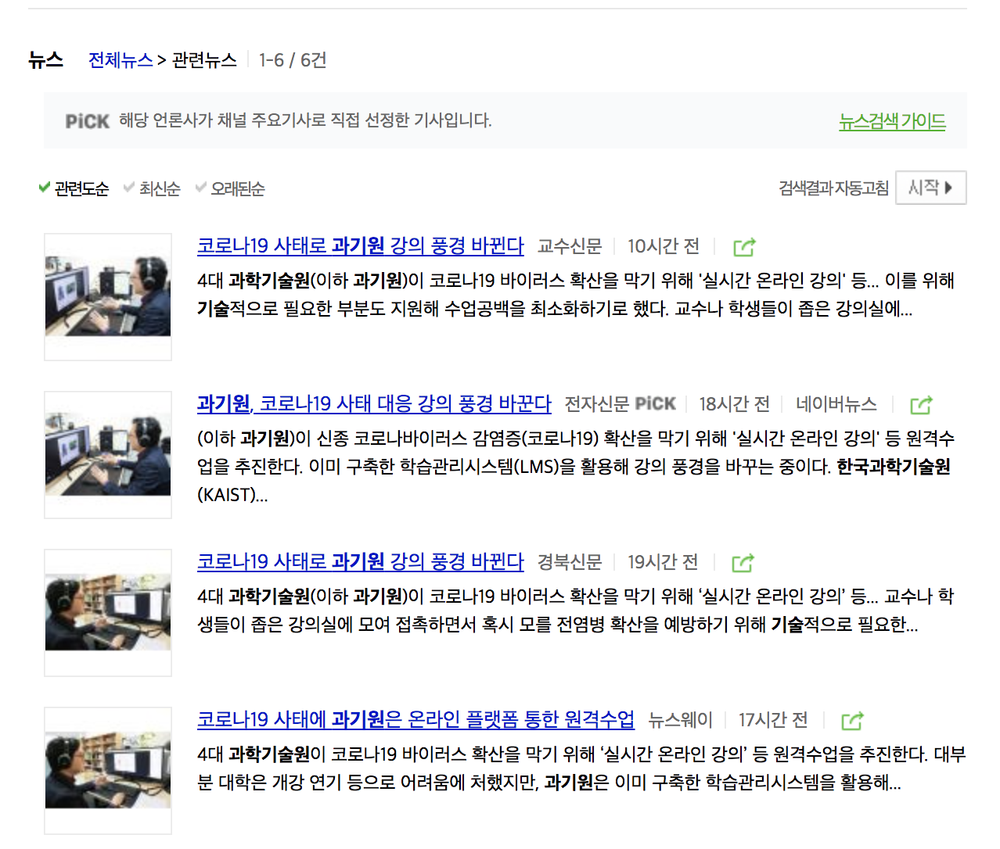
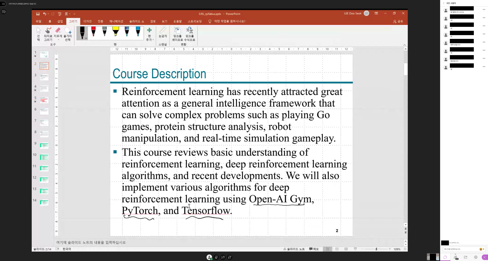
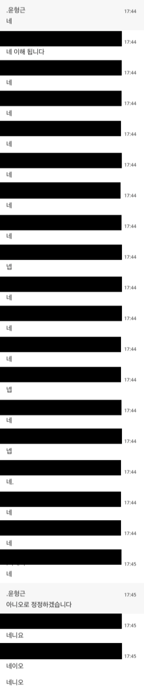

개강한지 3주가 지나가고 있지만, 나는 아직 학교를 가지 못했다. 코로나19의 유행으로 인해 많은 회사가 재택 근무를 진행하고 있고, 대다수의 회의가 원격으로 진행되고 있다. 유치원, 초등학교, 중학교, 고등학교는 개학을 23일로 미뤘으며, 많은 대학교는 개강을 미루거나 기존 대면강의를 온라인 강의로 대체하고 있다. 각종 학회도 취소가 되고 있는데, HCI 분야의 대규모 학회인 [CHI2020](https://chi2020.acm.org/)은 원격으로 진행될 예정이고, ML분야 대규모 학회인 [ICLR2020](https://iclr.cc/Conferences/2020)도 원격 미팅으로 학회를 진행한다고 한다. 모두 코로나19는 원하든, 원치 않든 우리 삶의 패턴을 변화시켰고, 그 중 가장 큰 변화는 강의, 수업, 회의와 같이 기존에 주로 대면으로 이루어지던 일이 온라인으로 이루어지고 있다는 것이다.

내가 재학중인 DGIST는 2월 24일 개강일을 연기하지는 않았지만, 1주차와 2주차를 reading 기반의 가정학습으로, 그리고 3주차부터는 실시간 온라인 강의로 수업을 하고 있다. DGIST뿐만이 아니라 많은 학교가 다음주부터는 온라인 강의를 진행할 예정이며, 특히 DGIST를 비롯해 KAIST, UNIST, GIST 등의 과학기술원은 실시간 온라인 강의를 추진하고 있다. KAIST의 경우 '줌(Zoom)'을, GIST의 경우 '줌(Zoom)'과 '스카이프(Skype)'를 이용한 실시간 강의를 준비중이고, DGIST와 UNIST의 경우에는 '블랙보드(BlackBoard)'라는 LMS(Learning Management System)에서 제공하는 Collaborate Ultra 기능을 통해 실시간 화상 강의를 진행중이거나 진행할 계획이다. 과거에 학교에서 튜터링을 하면서 친구와 장난으로 "그냥 우리가 튜터링하는 거 트위치나 아프리카TV로 방송하면 안되냐?"라는 이야기를 했는데, 이것이 실제 강의(!)에서 이루어지게 된 것이다.

 

사실 나는 사이버 강의, 온라인 학습, 화상 회의, 원격 근무, 재택 근무 등이 대면에서 만큼의 효율을 낼 수 있다고 생각하는 사람 중 하나이다. 실제로 DGIST에서 진행하는 UGRP(Undergraduate Group Research Program, 학부생 공동 연구프로그램)에서 회의를 진행할 때 방학때는 주로 스카이프를 활용했고, 인턴을 했던 kixlab에서는 학기중에 원격으로 연구에 참여하기도 했다. 이때, 모두가 물리적으로 모이지 않아도 회의는 잘 진행되었고, 작업에 참여할 생각만 있다면 장소는 큰 걸림돌이 되지 않았다. 이러한 경험을 하면서 모이기 힘든 경우에 억지로 모일 필요가 없다는 생각을 하게 되었고, 의지만 있다면 일이나 수업의 형태가 효율에는 큰 영향을 미치지 않는다는 생각이 들었다.

그렇다고 아예 온라인 강의에 문제가 없는 것은 아니다. 나는 효율보다는 인터랙션의 측면에서 온라인, 원격 강의에 문제가 있다고 생각한다. 가령, 온라인 강의에서는 교수자가 학습자의 피드백을 실시간으로 반영하기 어렵고, 학습자는 자신이 모르는 부분을 질문하기가 까다롭다는 인터랙션 문제가 있다. 또한, 인원수가 많더라도 서로가 모두를 볼 수 있는 대면 강의, 작업과는 달리 대규모 온라인 학습, 회의에서는 다른 사람의 모습을 한번에 볼 수 없는 문제, 그 안에서 소규모 그룹 토론이 어렵다는 문제도 존재한다. 이러한 문제를 해결하기 위해 HCI(Human Computer Interaction, 인간과 컴퓨터 상호작용) 분야에서 다양한 연구가 이루어져 왔는데, 대표적으로 앞서 언급했던 KAIST 전산학부의 [김주호 교수님](http://juhokim.com/)과 [kixlab](http://kixlab.org/)에서 online education, learning at scale이라는 주제로 관련 연구를 많이 진행하고 있다. 이처럼 온라인 강의에서 인터랙션 문제는 예전부터 많이 지적되었고, 현재도 계속해서 이 문제를 해결하기 위한 시도가 이어지고 있다.

이에 따라 나는 인터랙션 측면을 중심으로 이번 첫주간 DGIST에서 진행된 온라인 강의에 대한 내 생각을 적어보고자 한다. 사실 내가 전문성이 있는 사람도 아니고, 온라인 강의도 몇 가지 MOOC 강좌를 제외하고는 들어본 사람도 아니기 때문에 이 글은 처음으로 실시간 온라인 수업을 하게 된 한 학부생의 자잘한 생각으로 봐주면 좋을 것 같다.

 

#### 생각보다 쾌적한 온라인 강의
처음 해본 온라인 강의는 생각보다 쾌적했다. 온라인 강의를 했을 때 가장 큰 문제 중 하나는 네트워크 문제로 인한 끊김현상인데, 내가 들은 수업에서는 위의 문제가 발생한 경우가 없었다. 가끔씩 5초 정도 끊기는 경우가 있긴 했지만, 수업을 듣는데 크게 방해가 되지는 않았다. 이정도의 끊김현상은 어느 환경에서나 발생할 수 있는 정도였고, 해당 현상으로 인해 중간에 잠시 나갔다 들어오는 학생은 있었지만, 강의를 끝까지 제대로 듣지 못하는 학생을 적어도 내가 들은 강의에서는 보지 못했다. 하지만 이는 내가 들은 강의가 약 30명 내외의 강의였다는 점도 있고, 아침 9시와 같이 상대적으로 다른 강의가 적은 시간대의 강의였다는 점을 고려해야 한다. 실제로 학내 커뮤니티를 살펴보면 끊김 현상으로 인해서 수업에 제대로 집중하기 어려웠다는 사람도 있고, 강의를 끝까지 못한 수업도 있다고 한다. 학교 측에서도 해당 문제를 확인한 후 3월 12일자로 해당 문제를 점검하였다.

또한, 화상강의의 인터페이스와 시스템이 생각보다 괜찮다는 평이 많았다. 사실 블랙보드의 UI와 UX가 좋지는 않아서 기대를 안했는데, 생각보다 실시간 화상강의 시스템은 이용하기에 좋았다. 화면에는 크게 ppt와 같은 강의 노트를 띄울 수 있고, 화면 오른쪽에는 사용자의 채팅을 볼 수 있다. 또한, 현재 누가 접속해있는지 쉽게 알 수 있으며, 채팅은 모든 사용자가 참여하는 채팅뿐만이 아니라 일부 사용자와 일대일로 채팅할 수 있는 시스템을 갖추고 있었다. 출결시스템의 경우에는 화상 강의 입장이 5분 늦을 경우에는 시스템 상으로 자동 지각처리를, 강의 시간의 80% 이상 참여하지 않을 경우에는 자동 결석처리를 한다고 하는데, 이 덕분에 따로 출석을 부를 필요 또한 없었다. 손들기 기능이 있어서 궁금한 경우에는 직접 보이스를 통해서 질문을 할 수도 있고, 필요할 때마다 채팅을 통해 물어볼 수 있다는 점도 큰 장점이었다. 개인적으로 아쉬운 점이 있다면 강의노트와 교수자의 얼굴이 비슷한 크기로 나오지 않아 한쪽을 확대하면 한쪽은 너무나도 작아져 교수님이 따로 무언가를 들고 설명하시는 경우에는 동시에 두 화면을 볼 수 없다는 점이었다. 이를 제외하고는 온라인 강의 시스템 상에서 불편한 점은 없었던 것 같다.

강의를 하기 전까지의 준비가 거의 필요하지 않다는 점도 큰 장점이었다. 보통 강의를 들을려면 아침에 일어나서 물리적으로 모두 준비를 하고, 직접 강의실에 찾아가야 하는데, 온라인 강의에서는 그럴 필요가 없었다. 덕분에 정말 수업과 관련된 준비에 집중할 수 있고, 수업이 끝나면 집에서 바로 편하게 쉴 수도 있었다. 덕분에 공강이 있더라도 그 시간에 집에서 다른 일을 하면서 알차게 보낼 수 있고, 수업 시작 15분전부터 여유롭게 오늘 할 내용을 살펴볼 수 있었다. 특히, 9시부터 시작하는 수업의 경우 일찍부터 준비를 해야하는데, 온라인 강의를 하다보니 상대적으로 준비하는데 여유가 생겼다. 이러한 부분은 기숙사 생활이 대부분인 과기원보다는 다른 종합대에서 크게 드러날 것 같은데, 집에서 학교를 가는데 드는 시간, 학교에서 강의실을 이동하는 시간을 아끼는 것만으로도 학생들에게 많은 여유시간이 생기는 장점이 있을 것으로 보인다.

이처럼 나는 생각보다 깔끔한 인터페이스, 장소와 환경에 구애받지 않고 참여할 수 있다는 점, 걱정하던 끊김현상이 없었다는 점에서 실시간 온라인 강의에 큰 만족감을 느꼈다.

 

#### 온라인 강의가 익숙치 못한 교수님과 부담감을 느끼는 학생
위에서 말한 만족도도 컸지만, 이에 못지 않게 여러 문제도 있었다. 그 중 가장 큰 문제는 대다수의 교수님께서 온라인 강의가 익숙하지 않다는 것이었다. 상대적으로 젊은 학생들은 유튜브, 트위치 등의 스트리밍 서비스를 접하면서 실시간으로 영상을 보며 소통하는 것에 익숙하지만, 일반적으로 학생보다 나이가 있으신 교수님들은 상대적으로 이러한 서비스를 이용한 소통에 어려움을 느끼는 것으로 보였다. 

여기서 나타난 가장 큰 문제는 교수님께서 웹캠을 보면서 혼자 말씀을 하셔야 한다는 것이었는데, 이는 사실 전문 방송인이나 인터넷 강의에 익숙한 사람이 아니라면 누구나 겪는 어려움 중 하나일 것이라 생각한다. 강의에서 교수자와 학습자 사이의 소통과 인터랙션은 큰 비중을 차지한다. 단순히 질문과 대답뿐만이 아니라, 학습자의 반응, 끄덕거림, 눈맞춤 등 다양한 인터랙션이 대면 강의에서 이루어지는데, 온라인 강의에서는 이와 같은 과정이 불가능하다. 만약 모든 학생이 웹캠을 키고, 자신의 목소리를 낸다면 해결될 수도 있지만, 이는 강의의 규모가 커질수록 교수자의 음성을 듣는데 방해가 되거나, 강의 화면에 집중하기 어렵다와 같은 더 큰 문제를 유발한다. 결국 교수님은 학생들이 실제로 듣는지 안듣는지도 모르는 체 짧게는 1시간 30분, 길게는 3시간동안 끊임없이 말을 해야한다. 이와 관련해 어떤 교수님께서는 "벽을 보고 나 혼자 떠드는 것 같아서 답답하다"라는 말씀을 하기도 했다.

사실 위의 문제를 해결하기 위한 가장 좋은 도구는 채팅 시스템의 활용이다. 실제 인터넷 방송에서는 채팅의 역할이 상당이 큰데, 이는 방송인과 시청자 사이의 소통뿐만이 아니라 채팅에서 볼 수 있는 다양한 드립이 하나의 재미가 되기 때문이다. 그만큼 채팅의 위력은 강력하고, 채팅을 활용하면 위에서 말한 교수자와 학습자 사이의 인터랙션 문제를 어느정도 해결할 수 있을지도 모른다. 특히 많은 사람들이 온라인 강의가 시행된다고 했을 때 많이 이야기했던 것 중 하나가 이제 막 채팅으로 소통하고, 막 도네이션(...)하고 그러면 되는거냐는 물음이었으니 그만큼 채팅을 통한 소통에 기대감을 갖고 있었음을 알 수 있다.

하지만 기대와는 달리 실제 강의에서 채팅은 거의 조용했다. 가끔식 단체로 "네", "넵" 등을 말하거나, 교수님에 질문에 답하거나, 교수님에게 질문을 하거나, "잘 들립니다.", "잘 보입니다."와 같은 확인용 채팅을 제외하면 채팅은 거의 쓰이지 않았다. 아마 교수님과 학생이라는 관계에서 자유롭게 채팅을 하는 것이 어렵다는 점도 있을 것이고, 괜히 채팅을 쳤다가 강의에 방해가 될 수 있다는 생각을 하는 점도 있을 것이다. 이러한 문제도 있지만, 학생들이 채팅을 할 때 부담도 있지 않을까 싶다. 익명이 아닌 상황에서 채팅을 한다는 것, 무언가 질문을 하면 모두의 주목을 받는다는 것, 어찌보면 대면강의에서와 마찬가지로 이 문제는 온라인 강의에서도 지속되는 것으로 보인다. 결과적으로 이런 문제는 채팅이라는 좋은 인터랙션 도구의 활용성을 떨어트리고, 교수님은 혼자 강의를 하는듯한 답답함을 심화시키게 된다. 

손들기 기능과 보이스 기능, 카메라도 거의 쓰이지 않았다. 보통 보이스를 통해서 질문을 하고 싶을 때 손들기 기능을 사용하는데, 다들 자기 목소리를 공개하는 것을 꺼려하는 만큼 해당 기능이 쓰이는 일은 거의 없었다. 보이스를 통한 인터랙션도 거의 없었는데, 이번주에 내가 들은 4개의 강의중에서 단 1개의 강의에서 오직 1명만이 보이스를 통해 교수님과 인터랙션을 하는 모습을 볼 수 있었다. 보이스를 이용하는 것은 대면강의보다 더 부담이 커지는데, 앞서 말했듯이 모두에게 목소리가 들리고, 일반적으로 채팅을 대다수가 사용하는 상황에서 혼자 보이스를 쓴다는 것이 심리적으로 어렵기 때문이다. 당장 나도 저번 강의에서 친한 교수님의 목소리 좀 들려달라는 요청을 거절했다... (다시 한 번 교수님께 죄송...) 보이스도 거의 쓰이지 않는데, 카메라는 당연히 더 쓰이지 않을 것이다. 이는 자신의 얼굴을 보여줘야 한다는 부담감부터, 집이라는 사생활 공간의 노출을 감수해야하는 부분이 있기에 더욱 부담감이 커진다. 실제로 어떤 수업에서는 웹캠을 이용해 얼굴을 공개하도록 한 수업도 있었는데, 자신의 집과 방을 노출하기 싫어 사용하기 싫다는 의견이 있었다.

결국 교수자는 인터랙션의 부족함을 느끼고, 학습자는 인터랙션의 부담감을 느끼고, 이러한 상황이 반복되면서 강의가 루즈해지게 되는 일이 반복된다.

 

#### 더 나은 온라인 강의를 위하여

그렇다면 어떻게 더 나은 온라인 강의를 만들 수 있을까? 사실 이에 대한 해답은 제시하기가 어렵다. 당장 바로 해답을 내놓을 수 있다면 아마 위의 문제도 이미 해결되었을 것이다. 다만, 위의 문제를 새롭게 해결할 수 있는 인터랙션과 관련한 연구가 이미 등장했고, 앞으로도 등장할 것이다. 가령, [온라인 학습 환경에 참여하는 학습자와 강의자들이 각자의 Context를 쉽게 공유할 수 있는 매체에 관한 연구](https://dl.acm.org/doi/10.1145/3173574.3174129), [비디오를 이용한 학습에서 학생들의 상호작용을 통해 더 나은 navigation 방법을 찾는 연구](https://dl.acm.org/doi/10.1145/2642918.2647389), [녹화된 비디오 강의에서 소셜 인터랙션을 높이는 인터페이스에 관한 연구](https://dl.acm.org/doi/10.1145/2702123.2702349), [온라인 CS 교육에서 교수자와 학습자를 지원하는 플랫폼에 관한 연구](https://dl.acm.org/doi/abs/10.1145/2876034.2893406)과 같이 온라인 교육과 관련한 여러 연구가 이루어지고 있으며, [Learning at Scale](https://learningatscale.acm.org/)과 같이 온라인을 통해서 대규모의 학습과 관련한 주제를 다루는 학회도 존재한다. 이처럼 많은 연구자(특히 HCI 분야에서)가 온라인 강의, 교육에서 존재하는 현재의 문제점을 해결하고, 더 나은 학습을 위한 방법에 대해 연구를 진행하고 있다.

우리가 위에서 말한 문제도, 더 나은 인터랙션 방식을 통해 나아질 수 있을 것이다. 당장 좋은 생각이 나지는 않지만, VR과 같은 환경에서 온라인 강의를 하는 방법에 대해 고민해볼 수도 있고, 학생이 강의에 참여할 때 부담을 느끼지 않도록 익명을 보장하면서 교수자와 인터랙션 하는 방식에 대해 생각해볼 수도 있다. 위에서 언급한 문제말고도 더 많은 문제가 있을 것이고, 앞서 언급한 해결책보다 더 나은 해결책도 있을 것이다. 더 나은 온라인 강의를 만들기 위해, 이런 고민이 지속되었으면 좋겠다는 생각이 든다.

이번 코로나 19의 전세계적 유행으로 인해 많은 학교에서 온라인 강의를 진행하고 있거나, 진행할 예정이다. 어쩔 수 없이 온라인 강의를 하는 곳이 많겠지만, 이번 기회에 온라인 강의를 더 자세히 알아보는 시간을 가지면 어떨까 싶다. 왜 우리가 온라인 강의가 아니라 대면강의를 추구하는 이유는 무엇인지, 대면강의에 비해서 온라인 강의 장점과 단점은 무엇인지, 온라인 강의를 어떻게 개선시킬 수 있을지에 대해 고민하면 좋겠다. 김주호 교수님께서 다음과 같은 트윗을 남기셨는데, 말씀하신 것과 같이 대규모 학습에서 이루어질 거대한 field study을 통해 온라인 강의와 학습, 기존 우리가 진행하던 강의와 학습에서 큰 변화가 있기를 바란다. 
  
<blockquote class="twitter-tweet">
Due to COVID-19, ALL courses at KAIST will be given online, at least for the first few weeks of the spring semester until the situation improves. It&#39;s going to be a huge natural experiment for learning at scale. 1/3
&mdash; Juho Kim (@imjuhokim) <a href="https://twitter.com/imjuhokim/status/1234547969241669632?ref_src=twsrc%5Etfw">March 2, 2020</a></blockquote> 

