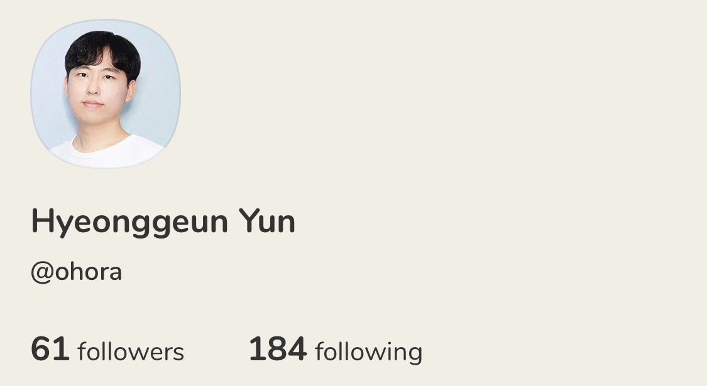
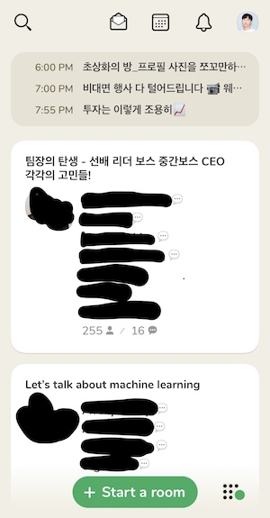

*"혹시 초대장 주실 수 있을까요? ㅠㅠ" - 처음보는 사람에게 초대장을 부탁하는 A*

*"빨리 초대장을 구하는게 중요한거야" - B에게 초대장을 구해오라고 말하는 A*

*"존경합니다ㅠㅠ" - 초대장을 구해온 A에게 감사하는 B* 

최근에 한 친구(A)와 내(B)가 한 대화의 일부이다. 우리가 이렇게 기다린 초대장은 바로 소위 요즘 핫한 SNS인 '[클럽하우스(Clubhouse)](https://www.joinclubhouse.com/)' 때문이다. 클럽하우스는 음성 기반의 SNS로, 2020년 4월에 출시되어 1년도 안된 따끈따끈한 서비스이다. 현재는 iOS 버전만 출시되어 아이폰, 아이패드 등으로만 사용이 가능하며, 초대장이 있어야 서비스를 이용할 수 있다. 자신이 팔로잉 하는 사람이 있는 방에 입장한 후 '청중(Audience)'이 되어 이야기를 들을 수 있고, 입장한 후에는 '손들기' 등을 통해서 직접 '스피커(Speaker)'가 되어 이야기를 할 수도 있다. 이 서비스를 처음 알게 된 건 친구를 통해서 일주일 정도 되었는데, 그 사이에 엘론 머스크가 여러 이야기를 한것으로 알려져 더욱 화제가 되었다. 한국에서도 많은 연예인분들과 셀럽분들이 가입하면서 인기를 몰고 있다.

클럽하우스의 큰 특징 중 하나는 앞서 이야기했듯이 서비스 이용을 위해서 초대장이 필요하다는 것이다. 초대장은 처음 가입시 2장이 주어지며, 각 방에서 '사회자(Moderator)' 역할을 자주할수록 초대장이 더 많이 생긴다고 한다. 한국에서는 이러한 메커니즘으로 인해 "인싸"가 쓰는 서비스로 불리기도 했고, 서비스에 대한 궁금증과 기대감을 높이기도 했다. 나 또한 초대장을 얻기 위해서 3일간 별 고민을 다 했다. "대체 어떤 서비스이길래 이렇게 인기가 많은거지?"라는 생각을 하다가 친구가 처음보는 분에게 초대장을 구해와서 지난 목요일 드디어 클럽하우스를 사용하게 되었다.

클럽하우스를 처음 가입하고 나서 내가 한 일은 1) 서비스가 추천해주는 사람 팔로잉하기, 2) 지인한테 초대보내기, 3) 인스타그램에 자랑하기였다. 근데 막상 그 후에 뭘 해야할지 잘 몰랐다. 그러다가 홈 화면을 가보니, 몇몇 팔로잉을 한 사람들이 들어가 있는 흥미로운 방이 나타났다. 해당 방에 들어가서 이야기를 들어보니 재미있기도 하고, 목소리를 듣는다는 게 신기하기도 했다. 무엇보다 이름은 알고 얼굴과 목소리를 모르는 분들의 이야기를 들을 수 있다는 게 새로운 경험이었다.

Fig 1. 나의 클럽하우스 프로필

 

이 글에서는 내가 클럽하우스를 4일간 사용하면서 느낀 경험과 생각을 이야기하고자 한다. 나름 7년전에 24시간동안 글이 지속되는 SNS인 '하루(www.harooo.com)'를 개발하여 3일만에 몇 천명의 사용자를 모은 사람(그리고 운영을 제대로 못한 사람...)으로서 클럽하우스의 장점과 아쉬운 점, 앞으로의 기대를 짧게 정리해보았다.

#### **비슷한 듯 다른 클럽하우스**

클럽하우스는 기존 SNS와 비슷하면서도 많이 달랐다. 우선 '오디오(audio)'라는 모달리티(modality)에 주목했다는 것이 가장 큰 특징이다. 초기 SNS(페이스북, 트위터)는 텍스트를 중심으로 폐쇄/개방 여부에 따라, 요즘 인기인 SNS(틱톡, 인스타그램)는 사진이나 비디오 기반의 숏폼 형태의 컨텐츠로 이루어졌다면, 클럽하우스는 오디오 기반의 롱텀 컨텐츠라는 점에서 확실한 차별점이 있다. 짧게는 몇 분부터 길게는 몇 시간, 몇 일에 걸쳐 방이 지속되다보니 하나에 주제에 오래 집중할 수 있다는 점에서 사용자를 같은 방에 오랫동안 묶어둔다. 오디오는 텍스트나 비디오와 달리 시각적인 집중이 필요없고, 롱텀 컨텐츠는 하나의 주제로 여러 사람의 다양한 이야기를 한번에 들을 수 있어 자신의 할 일을 하면서 여러 인사이트와 지식을 얻을 수 있다.

또한, 클럽하우스는 많은 컨퍼런스의 패널 세션과 비슷하면서도 다른 느낌을 준다. 각 방마다 사회자와 스피커가 있어 이야기를 하고, 그 이야기를 많은 청중이 듣는다. 작게는 몇명부터 크게는 몇 백명의 청중 앞에서 몇몇의 스피커가 말하는 건 우리가 많이 보던 컨퍼런스의 패널 세션과 유사하다. 하지만 여기서 일반적인 컨퍼런스의 패널 세션과 다른 점은 스피커의 수가 무한하게 확장된다는 점이다. 자신이 하고 싶은 말이 있거나 질문이 있으면 자유롭게 손을 들어 스피커가 될 수 있고, 이후 대화에 계속 참여할 수 있다. 이런 기능을 통해서 하나의 방에서 다양한 이야기가 쌓이게 된다. 덕분에 몇 시간동안 계속해서 대화를 하더라도 충분히 많은 스피커가 확보되면 지루함이 떨어진다.

방마다의 주제와 특징도 다르다는 것도 확실히 매력히 있다. 기존 SNS가 특정 주제에 대해 이야기를 할 때 '해쉬태그(Hash Tag)' 등을 이용해서 여러 주제에 관한 이야기를 모았다면, 클럽하우스에서는 '방'이 그런 역할을 한다. 자신이 원하는 주제로 방을 만들 수 있으며, 그 주제도 노래 부르는 방, 고민상담, 친구소개, 토론, 아무말, 취미, 성대모사, 묵언수행 등 다양하여 특정 주제가 지루해질 때 다른 주제로 잠시 이야기를 전환할 수 있다. 평소에 만나기 어려운 유명인들을 만나 대화할 수도 있고, 성대모사 방에서 웃을수도 있고, 특정 주제에 대한 토론이나 지식을 얻으면서 인사이트를 쌓을 수 있다.

그리고, 이러한 이야기는 모두 실시간성과 휘발성을 가지고 있다. 모든 이야기는 따로 사용자 측면에서는 녹음되거나 쌓이지 않는다 (서버에는 쌓이겠지만...). 그래서 특정 시간대를 놓치면 못 듣는 이야기도 있고, 해당 방이 사라지면 그 동안 했던 모든 기록도 사라진다. 이런 특징이 사람들로 하여금 그 시간대에 클럽하우스에 있도록 만들고, 좀 더 여러 이야기를 할 수 있게 만든다. 물론 이 특징이 단점이자 문제점이 될 수 있다. 다만 아직 사람이 적고, 커뮤니티 관리가 잘 되고 있어서 사람들이 좀 더 자유롭게 발언할 수 있는 장점으로 작용하고 있는 것 같다.

결과적으로 이러한 장점이 결합하여 일반적인 통화와는 또 다른 느낌을 준다. 통화가 지인간의 음성 커뮤니케이션에 가깝다면, 클럽하우스는 지인과 모르는 사람, 평소에 알고만 있던 사람을 모두 연결시킨다. 그리고 이 연결에서 '실재감'이 느껴진다. 페이스북이나 트위터 등은 텍스트 기반이라 상대방으로부터 실재감이 덜 느껴지고, 인스타그램이나 틱톡은 비디오 기반이라 실재감은 확실하지만, 비디오가 부담스러운 사람이 많고, 뭔가 그 사람과 교류한다는 느낌을 덜하다.  클럽하우스는 오디오 기반이라 비디오보다 부담스럽지 않으면서 목소리가 있어 실재감이 확실하다. 그래서 자신과 멀어보이던 사람과 접점을 찾고 더 가까이 다가가는 느낌을 준다. 

#### 하지만 보완이 필요한 클럽하우스

앞서 클럽하우스의 장점에 대해 설명했지만, 아직 MVP 레벨의 서비스이다보니 부족한 점과 보완할 점도 많다. 가장 시급히 해결해야할 문제는 '접근성(accessibility)'이다. 아직은 오직 음성으로만 대화가 이루어지고, 텍스트 등이 지원되지 않아서 기존의 텍스트, 비디오 기반 SNS보다는 접근성이 많이 떨어진다. 오디오라는 측면에서 어려움이 있을 수 있지만, 접근성에 대한 고민과 해결은 필수인 만큼 어떻게 하면 빠른 시일내에 이 문제를 극복할 수 있을지가 중요해보인다. 기술적으로 해결하기 어렵다면, 이 부분을 인터랙션의 측면에서는 어떻게 풀 수 있을지 생각할 필요가 있는 것 같다.

또한, 생각보다 사용할 때 에너지와 피로감이 든다. 처음에는 오디오 기반이라서 크게 집중하지 않아도 될 거 같았는데, 생각보다 많은 에너지가 필요하다. 처음에 사용할 때는 클럽하우스를 하는 동안 계속 앱만 바라보고, 다른 일을 거의 하지 못했다. 지금도 다른 일을 하면서 집중하면 다른 소리가 잘 들리지 않는다. 단순하거나 반복적이거나, 익숙한 테스크의 경우에는 클럽하우스를 같이 사용하는 게 쉽지만, 익숙하지 않거나 좀 더 생각이 필요한 테스크이면 클럽하우스에 집중하기가 쉽지 않은 것 같다. 더 나아가 스피커가 되면 이런 문제는 더 심해진다. 스피커의 특성상 계속 이야기에 참여해야 하는데, 다른 일을 하기는 쉽지 않다. 또한, 스피커 대화시 직접 음소거 버튼을 일일이 눌러줘야 해서 소음이 큰 작업은 하기가 힘들다. 스피커가 많을 때도 이 문제가 발생하는데, 지인이 아닌 이상 각자의 목소리를 잘 모르다보니 누가 말을 하는지 몰라서 더욱 집중을 하게 된다. 나 같은 경우에는 한 10명만 넘어가도 목소리가 헷갈렸고, 앱에 더욱 집중을 해야했다. 오디오를 쓴다고 아예 에너지가 안드는 것이 아니기 때문에 에너지가 안 들도록 하는 것은 어렵겠지만, 음소거를 일일이 해야하는 어려움 등은 개선이 필요할 것으로 보인다.

그리고 나 같은 내향적이면서 통화공포증이 있는 사람은 버튼을 누를 때 따로 confirm하는 기능이 없다는 게 무서웠다. 먼저, 방을 들어갈 때 따로 confirm이 없고, 다른 사람이 들어왔을 때 알림을 잘못누르면 welcome 방이 만들어지기도 한다. 또한 잘못눌러서 손들기를 할 수도 있다. 이 때문에 급하게 어플을 종료한 적이 많았는데, 나 같이 심약한 사람을 위해서 방 입장이나 손들기 같은 기능은 한번 더 confirm을 해주면 좋겠다.

최근에는 내가 원하는 방을 찾기 어렵고, 방을 찾는 시간이 늘기도 생각도 들었다. 관심은 있지만 오랫동안 지속된 방이나 내용을 팔로업하기 어려워서 입장을 안하기도 하고, 스피커로 참여하고 싶지만 너무 전문적이어서 참여하기 부담스럽기도 했고, 내가 원하는 주제가 없거나 나랑 상관없는 계속 새로고침을 하기도 했다. 시간이 지날수록 방에 머무는 시간이 짧아지고 오히려 방을 찾는 시간이 늘어나는 것 같은데, 이때문에 흥미가 떨어지는 느낌도 있다. 이에 대해 친구와 이야기 해봤는데, 뭔가 1) 정말 주제에 관심이 있거나,  2) 순수하게 내용이 재밌거나, 3) 스피커로 참여해 말을 해야  재밌다는 결론이 나왔다. 근데 1, 2는 누군가 방을 만들거나 내가 방을 만들지 않는 이상 찾기가 쉽지만은 않고, 3은 용기가 필요하다보니 이 문제 해결이 쉽지 않은 것 같다.

더 나아가 향후 초대장 기반이 아니라 모두에게 오픈되면 생기는 문제도 고려할 필요가 있다. 이미 트럼프 지지자들이 따로 방을 만들기도 하고, 향후에도 기본 인권에 반하는 여러 방이 생길 수 있다. 앞서 언급한 것처럼 휘발성과 실시간성을 가지고 있어서 말을 자유롭게 할 수도 있지만, 말에 책임을 지지 않는 경우도 많이 생길 수 있다. 어떻게 하면 자정능력을 갖춘 커뮤니티로 발전하면서 많은 사용자를 유치할 수 있을지 클럽하우스도 계속해서 고민할 것이라 생각한다. 

마지막으로 그냥 조그마한 개선점이 있었다. 일단 따로 홈버튼이 없어서 팔로잉을 하려고 들어간 프로필 페이지의 depth가 길어지면 홈버튼이 없어서 처음에는 일일이 나가야 하는 줄 알았다. 근데 사실 왼쪽 상단의 나가는 버튼("<")을 길게 누르면 홈으로 갈 수 있는 탭이 나왔다. 또한, 생각보다 배터리가 빨리 닳아 계속해서 충전을 해줘야 하는 불편함도 있었다. 이런 자잘한 문제나 불편함이 있는데, 이 부분은 차차 고쳐질 것이라 생각한다.

#### 클럽하우스는 어떻게 될까?

Fig 2. 클럽하우스 메인 화면

 

클럽하우스는 단기간에 정말 많은 화제를 몰고 왔고, 인기를 끌고 있다. 특히 클럽하우스 덕분에 코로나로 인한 대화에 굶주림을 느끼던 사람들에게 새로운 대화의 창구가 생겼다는 점에서 앞으로도 클럽하우스는 계속해서 사용량이 증가할 것이라 생각한다. 특히 평소에 듣기 어렵던 전문가 집단이나 셀럽, 여러 사람의 이야기를 생생하게 들을 수 있고, 자연스럽게 새로운 사람을 알아갈 수 있어 거기서 오는 흥미도 크다. 또한, 클럽하우스 내에서 새로운 문화나 컨텐츠가 생기고 있다는 점이 흥미롭다. 2030세대로 이루어진 방은 소위 '반모(반말모드)'가 적용된 방이 많이 있어 기존의 문화를 깨고 있고, 어떤 작가님은 매일 6시마다 11명을 뽑아 프로필 얼굴 사진을 그려주는 컨텐츠를 하고 계신다. 뿐만 아니라 박수를 대신해 음소거 버튼을 연속을 껐다 켰다 하는 등 새로운 규칙도 생기고 있다. SNS 내에서 새로운 규칙과 문화가 생기는 만큼 당분간은 클럽하우스가 계속해서 이 신드롬을 이어갈 것으로 보인다.

그렇다면 장기적으로도 클럽하우스가 이 인기를 이어갈 수 있을까? 그건 아마 클럽하우스를 만든 사람들이 어떻게 운영을 하느냐에 따라 달라질 것 같다. 지금까지 드러난 장점이나 문제가 사라질수도 있고, 더 커질수도 있다. 특히 사용자가 많아질수록 이런 문제가 더 커질텐데 어떻게 하면 그것을 컨트롤 할 수 있는지가 중요할 것으로 보인다. 당장 나같은 경우도 앞서 말한 것처럼 SNS 서비스를 제대로 운영하지 못해 사용자가 급격하게 줄어든 경험이 있어서 이 부분이 정말 중요하다고 생각한다. 서비스를 만드는 것도 중요하지만 어떻게 현재 모은 사용자를 유지할 것인지가 더 큰 고민이 될 것 같다. 클럽하우스의 경우에는 아직까지는 이런 문제를 잘 대처하고 있는 것으로 보인다. 

지금까지 클럽하우스에 대한 짧은 후기와 생각을 적어보았다. 클럽하우스는 아직 서비스가 출시된지 1년도 되지 않았지만 벌써 1000만명의 사용자를 향해 달려가고 있다. 아직 MVP 레벨의 서비스인데 굉장히 깔끔하고 심플해서 앞으로 어떻게 변화할지 기대가 크다. 새롭게 등장한 SNS가 얼마나 지속되고, 떠오를 수 있을지 기대가 된다.