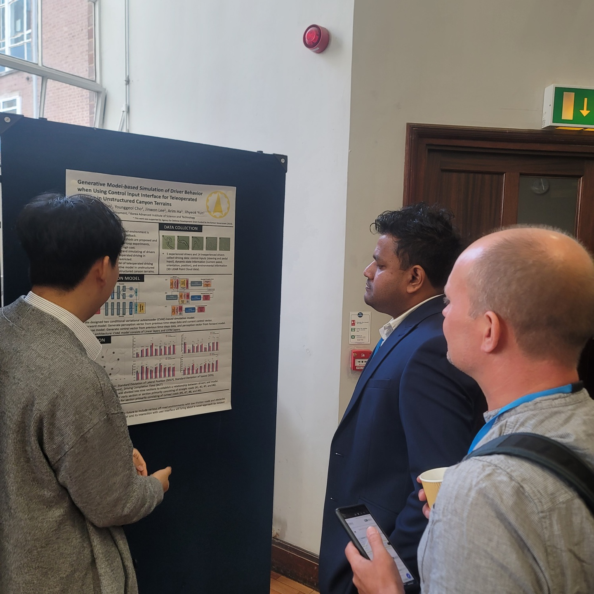
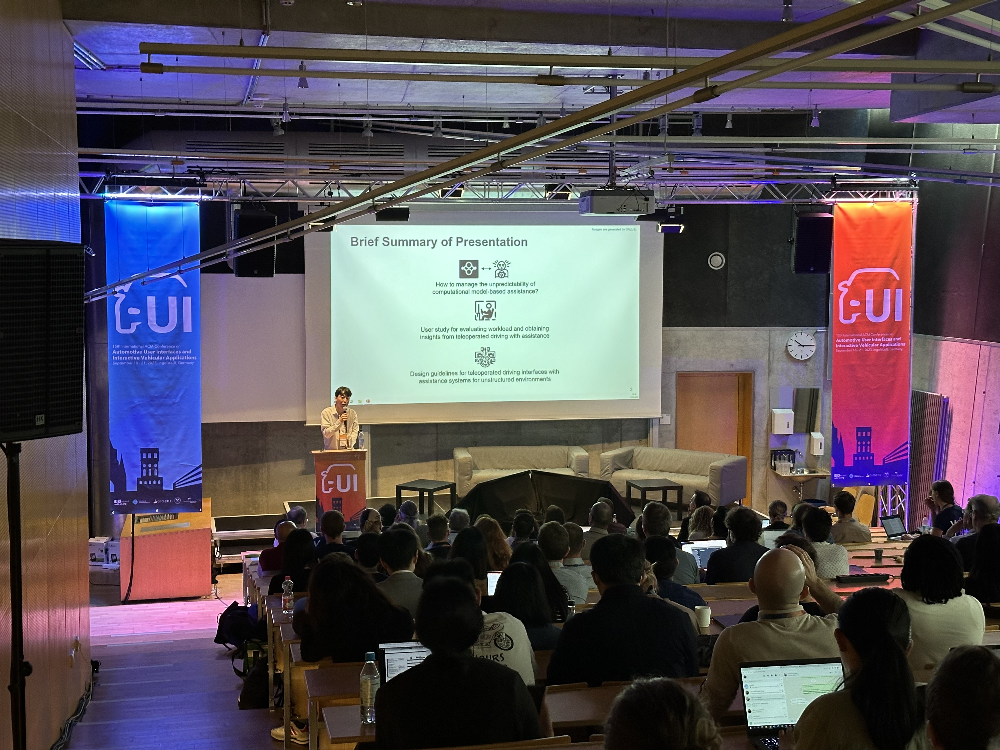
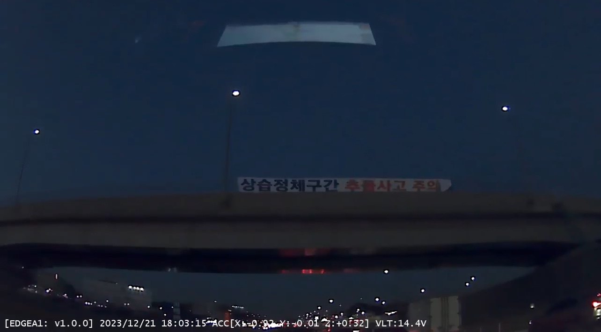
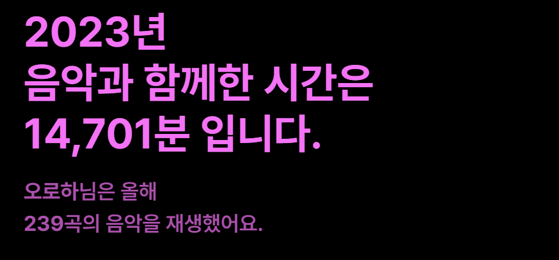
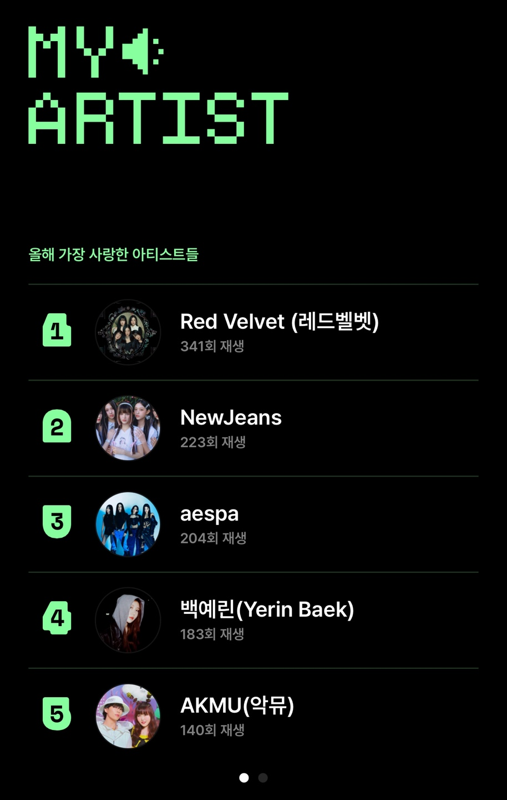
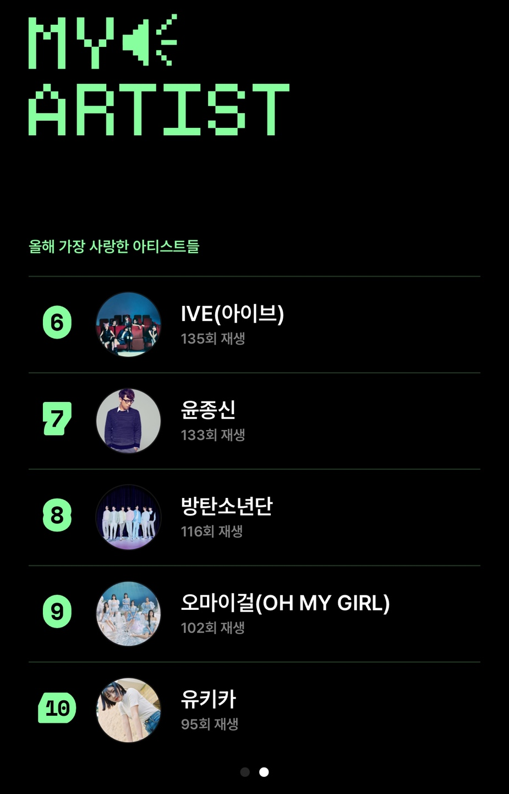
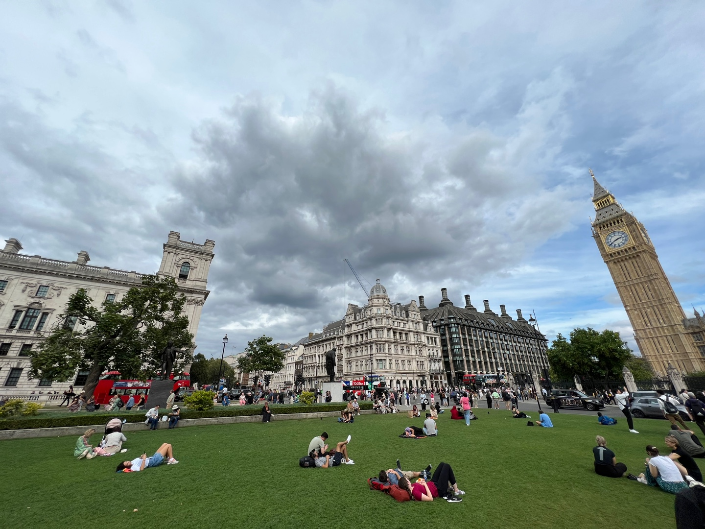
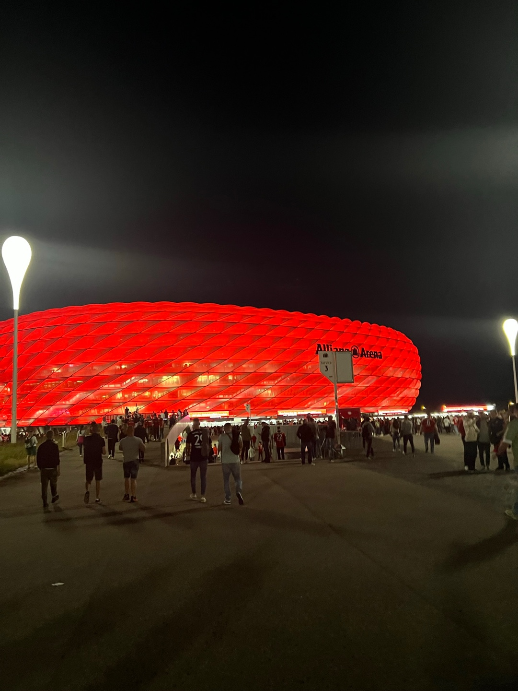
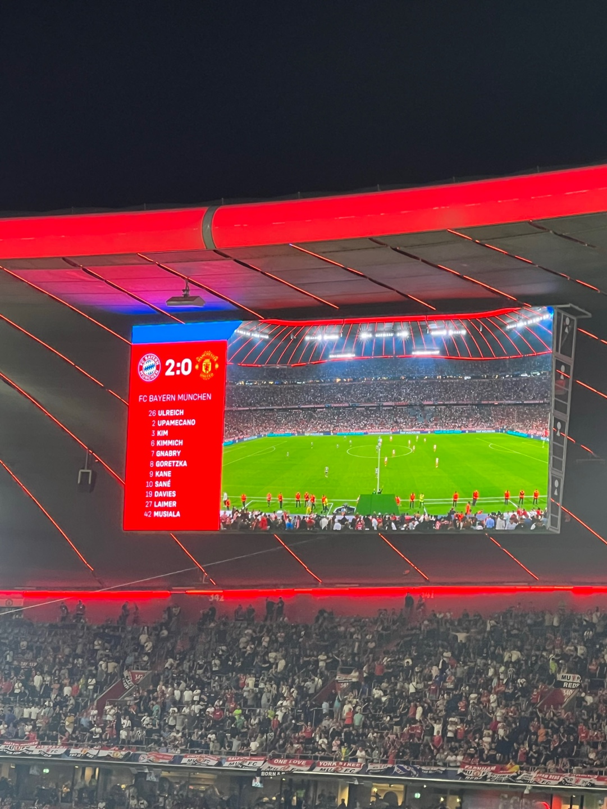

2024년 1월 1일 새해가 밝았다. 엊그제 2023년 1월 1일이 된 것 같았는데, 벌써 2024년이라니... 한 해가 참 빠르게 지나간다는 생각이 든다. 어쩌다보니 교통사고를 겪게 되어 연말을 병원에서 지내게 되었는데, 병원에 오래 있다보니 심심하기도 해서 연말연초를 기념(?)하여 한 해를 돌아보기로 결심했다.

###벌써 3년차에 접어든 연구소 생활

한 해를 돌아볼 때 빼놓을 수 없는 것 중 하나가 연구소에서의 생활이다. 나는 현재 과학기술전문사관이라는 제도를 통해서 국방과학연구소에서 근무를 하고 있는데, 2021년 6월에 입소를 했으니 벌써 3년차에 접어들게 되었다. 팀에서 주어진 과제를 수행하며, 과제 수행에 필요한 연구와 행정처리를 하는 것이 나의 주된 업무이다.  

보안 문제로 내가 현재 수행하는 과제에 대해서 자세히 말하기는 어렵지만, 연구소에서의 생활은 어느정도 패턴이 비슷하다. 

- 아침 기상 및 준비 후 10-15분 가량 운전해서 출근
- 출근 후 카페인 섭취하며 메일을 읽으며 해야할 일 정리
- 과제 수행에 필요한 행정처리 진행
- 이번주에 해야하는 일을 바탕으로 페이퍼 읽기, 개발, 코딩, 시스템 테스트, 평가, 자료 작성, 인프라 관리 등 수행
- 구내식당에서 점심식사
- 필요시 과제를 같이 수행하는 업체 요청 지원 및 출장
- 과제 관련 실무 회의 및 월례 회의
- 연구 내용 정리하여 시사점이 있는 경우 논문 작성 
- 귀가 후 개인 생활

거의 대부분의 생활이 이 안에서 진행되기 때문에 어찌보면 정형화된 하루라고 볼 수 있을 것 같다. 그렇지만 매일 해야하는 일, 그 주의 해야하는 일이 다르며, 연구와 과제를 수행하다보면 예상치 못한 문제를 만나게 되고, 이에 따라 할 일이 달라진다. 뿐만 아니라 연구소에서 요구하는 잡다한 일부터 군에서 요구하여 해야하는 일, 과제에서 해야하는 여러 일 등을 수행하다보면 순식간에 하루가 지나간다. 작년 초에 했던 생각 중 하나가 "같은 회사를 몇 십년간 다니면 앞으로 몇 십년간 비슷한 생활을 해야해서 심심하지 않을까"라는 생각이었는데, 올해는 비슷한 생활 속에서도 다양한 사건사고(?)가 있을 수 있다는 것을 깨닫게 되었다.

#### 문제를 발견하고 해결하는 과정을 경험하다

올해의 경험 중에 가장 값진 것이 있다면, 문제를 발견하고 해결하는 과정을 경험한 것이다. 연구과제의 특성상 주어진 목표를 달성하는 과정에서 여러 문제가 나타나게 되고, 그걸 해결하는 것이 중요한 일이었다. 특히 올해는 설계를 넘어 구현에 집중하는 해였기 때문에 이러한 경험을 굉장히 많이 할 수 있었고, 이 때문에 굉장히 바쁜 한 해가 되었다. 

과제를 수행하면서 시스템을 구현하고 개발하거나, 새로운 방법을 제시하고, 이를 검증 및 테스트 하다보면 예상치 못한 여러 문제가 발생한다. 이때 1) 현재 직면한 문제가 무엇이고, 2) 원인은 무엇으로 추정되며, 3) 그 문제를 어떻게 해결할 것인가?라는 3단계의 과정을 거쳐 문제를 해결하는 경험을 했다. 이 과정을 거치면서 문제와 문제의 원인이 명확해지고, 명확해진 원인을 해결하는 방법을 깨닫게 되면 보다 빠르고 정확하게 문제를 해결할 수 있었다. 이때 이전의 연구와 논문을 참고하고, 다른 사람의 의견을 들어보고 조언을 구하기도 하며, 코드와 데이터를 분석하면서 문제의 원인을 찾고, 기존의 방법과 내가 채택한 방법이 무엇이 다른지 생각하는 것이 큰 도움이 되었다. 특히 과거에 비슷한 문제를 경험한 사람의 의견을 들어보는 것과 분석을 통해 문제의 원인을 찾는 것이 굉장히 중요하고, 이 과정이 문제 해결 과정을 단축할 수 있다는 것을 알 수 있었다. 이 때문에 기록하는 습관의 중요성 또한 알게 되었는데, 문제의 원인이나 다른 사람의 의견을 들어보면 과거에 내가 언젠가 했던 경험이거나 내가 이미 알고 있지만 기억을 못하는 경우가 꽤 많았기 때문이다. 이렇게 문제 해결 과정을 체화할 수 있던 것이 올해의 값진 경험이었다.

#### 연구 성과물을 창출하다

2023년에는 과제 수행과 성과 창출이라는 2마리 토끼를 잡았다. 감사하게도 과제 수행 중에 작성한 3편의 논문이 엑셉되었다. 1편은 공동저자로, 2편은 1저자로 참여하였고, IEEE Robotics and Automation Letters (RAL) SCI 저널과 Toward Autonomous Robotics Systems (TAROS) 2023 컨퍼런스, ACM Automotive User Interfaces and Interactive Vehicular Applications (AutoUI) 2023 컨퍼런스에 출판 및 발표했다. 각각의 논문을 작성하면서 고생도 많이 했고, 리비전 하는 과정에서도 최종 억셉이 될 수 있을지 걱정이 많았는데, 좋은 결과를 얻어서 기쁘다.

IEEE RAL에 출판된 논문은 2022년 초부터 준비하였고, 리비전을 2022년 연말에 시작하여 2023년 초까지 진행했다. 해당 페이퍼는 초보 운전자의 원격 운전을 도와주는 시스템에 대한 페이퍼였고, 나는 모델 및 시스템 구현과 학습, 실험 진행 및 논문의 일부 파트 writing을 맡았다.  그 과정에서 필요할 때마다 다른 저자들과 discusssion을 하고, 완성한 후에도 계속 수정을 하며 첫번째 버전의 페이퍼를 제출했다. 그 후 2022년 연말에 첫번째 리뷰를 받았는데, 긍정적인 평가와 함께 여러 의문이 리뷰어로부터 제기 되었고, 추가 실험과 수정을 한 달안에 끝낼 수 있도록 요구받았다. 이 때문에 2022년 연말에는 다른 저자들과 함께 논문 리비전에 집중했다. 연말 휴가도 반납하고 리비전에 집중할 정도로 1저자 및 다른 공동저자와 고생을 많이 했고, 리뷰어의 코멘트를 잘 보완해 좋은 결과를 얻을 수 있었다. 지금까지 여러 논문을 제출해 보았지만, 저널에 제출하여 고유의 리비전 프로세스를 경험해본 것은 이때가 처음이었다. 덕분에 리뷰 및 리비전 프로세스를 이해하고, 어떻게 리뷰어의 코멘트에 대응하고 내 연구를 설명해야 하는지 고민해보는 좋은 경험이었다.

TAROS 2023과 AutoUI 2023에 제출한 논문은 1저자로 내가 리드한 프로젝트였다. 각각 무인차량의 원격 운전 과정과 이를 보조하는 시스템에서 초보 사용자에게 발생할 수 있는 문제를 다룬 페이퍼였고, 1저자여서 논문의 전체 흐름과 구현, 실험 등에 주도적으로 참여했다. 이를 통해 1저자로서 프로젝트를 리드하는 방법과 전체 논문의 흐름과 논리를 세우고 이를 글로 표현하는 방법에 대해 많이 배울 수 있었다. 물론 아직 많이 부족하지만, 주도적으로 연구를 하는 방법, 다른 저자와의 discussion을 통해 페이퍼를 개선하는 과정을 경험할 수 있었다. 특히 이 과정에서 다른 저자와 사람들의 피드백의 중요성을 절실히 느낄 수 있었다. 논문과 같이 긴 글을 작성하다보면 나도 모르는 사이 흐름이나 논리가 흔들릴 수 있고, 내가 설명한 내용이 다른 사람에게 이해가 되지 않을 수 있는데, 이를 다른 사람들의 피드백을 통해 충분히 개선할 수 있었다. 이를 통해 프로젝트를 리드한다고 내가 모두 다 하겠다는 생각보다는, 다른 저자 및 사람들과 지속적으로 이야기를 하면서 더 좋은 프로젝트를 이끌어가는 것이 중요하다고 느꼈다.

또한 각 컨퍼런스에 참여하면서 많은 것을 느낄 수 있었다. 일단 첫번째는 영어의 중요성... 둘 다 국제 학회였고, 기본적인 소통의 베이스는 영어였다. 영어로 읽고 쓰는 것은 어떻게 하지만, 영어로 말하고 듣는 것은 여전히 부족함이 많았다. 특히 발표와 질의응답 세션에서 내 생각을 영어로 완벽히 표현하지 못해 아쉬움이 많았다. 발표 세션 뿐만 아니라 네트워킹에서도 영어의 자신감이 없다 보니 주도해서 말하기보단 대답을 하거나 소극적인 네트워킹만 하게 되었다. 그래도 이야기를 하면서 새로운 인연을 만날 수 있었지만, 더 깊고 여러 이야기를 하기 위해서는 영어가 필수적이라는 것을 뼈저리게 느꼈다. 두번째는 첫번째와 연결되는데, 학회에서는 먼저 다가가는 용기가 필요하다는 것이다. 나는 이번 컨퍼런스가 처음으로 참석하는 in-person 컨퍼런스였는데, 사실상 아는 사람이 거의 없었다. 거기다가 내가 워낙 낯가림이 심하다보니 쉬는 시간에 먼저 다가가서 이야기를 하는 것에 어려움을 느꼈고, 나빼고 다들 친해보여서 더 어려움을 느꼈다. 그래도 다행히 한국분들을 포함해 다양한 분들이 먼저 다가와서 이야기를 해주시고, 새롭게 알게 된 분은 방황하는 나를 데리고 다양한 연구소와 대학, 기업에서 오신 분들을 소개시켜주고 이야기를 할 수 있게 해주셔서 감사했다. 이를 통해 학회에서는 모르는 사람이라도 먼저 다가가서 나를 소개하고 이야기하는 것이 중요하다고 느꼈다. 타고난 성격을 바꾸기는 어렵겠지만, 다음에 학회에 참석한다면 더 용기를 내보고자 한다.

Fig 1. TAROS 2023 발표

Fig 2. AutomotiveUI 2023 발표

### 개인적인 생활 돌아보기

삶의 많은 부분이 일과 직장이기 때문에 개인적인 일은 상대적으로 적었다. 그냥 일상의 여러 일 중 하나지만 몇가지를 기록해놓고자 한다.

#### 익숙해진 운전, 하지만...

연구소에 일하면서 출퇴근, 출장, 주말에 본가-대전 장거리 운전 등을 통해 운전이 꽤 익숙해졌다. 면허는 고등학교 3학년때 바로 땄지만 운전할 일이 없었는데, 연구소에 오면서 자연스럽게 할 수 밖에 없는 환경이 조성되었다. 덕분에 1년에 약 10,000~15,000km를 차로 다니며 운전이 익숙해질 수 밖에 없었다. 티맵 기준에 따르면 한달에 약 1,000 ~ 1,200km를 다니고 있고, 고속도로 등을 통한 장거리 운전만이 아니라 시내 운전, 출퇴근 운전 등을 하면서 다양한 환경, 새로운 환경에도 쉽게 적응할 수 있게 되었다. 특히 운전을 하면서 다른 차들도 나름 운전을 잘하면서 사고 안나게 잘 피해가고, 잘 다닌다고 믿음을 갖게 되었다. 그런데...

약 11일전에 고속도로에서 사고가 났다. 사고 원인은 황당한데, 고속도로 정체구간에서 앞 차가 그 앞 차와 부딪힌 후에 갑자기 후진을 했다. 그렇게 해서 내 차와 충돌했고, 충돌한 후에 다시 전진을 해서 앞 차와 다시 충돌했다 (...) 처음에는 "이런 사고가 날 수 있나?" 당황스러웠고, 어떻게 사고처리를 해야할지도 막막했다. 뒤에서는 다른 차들을 정리해야하고, 앞에서는 내 차를 견인해가려고 하고, 나랑 부딪힌 차는 저 앞에 가있고.... 다행히 2차 사고 없이 잘 수습이 되었고, 상대차량이 100% 과실을 인정해서 사고 처리 걱정을 덜었다. 그 후에 어떻게 집에 돌아왔는데, 돌아온 후에 긴장이 풀려서 인지 온 몸이 아프기 시작했다. 늦은 시간이라 다음날 병원을 가고 결국 입원을 했다. 10일 정도 입원을 하고 현재는 퇴원을 했는데, 아직도 팔과 손저림과 어깨 및 목 통증, 무릎 통증과 다리 저림이 남아있어서 계속 치료를 다니고 있다. 덕분에 연말을 병원에서 보내 아쉽지만... 크게 다치지 않은 것에 감사한다. 이번 기회에 교통사고의 전체적인 프로세스를 경험하면서 "인생의 좋은 경험이다"라는 생각으로 다양한 정보를 찾아보고 있다. 결과적으로 교통사고는 안 나는 것이 가장 좋지만, 혹시 앞으로 사고가 나더라도 이번보다 더 잘 대처할 수 있을 것 같다. 

Fig 3. 블랙박스에 교통사고 후 찍힌 플랜카드(...)

#### 2023년 음악과 함께한 시간은 14,701분

원래 일할 때나 무언가를 할 때 음악을 잘 듣지 않는다. 다만 운전할 때는 졸음 퇴치와 심심한 귀를 위해 음악을 듣는다. 운전하는 시간이 많아지면서 자연스럽게 음악을 듣는 시간도 많아졌다. 나는 네이버의 Vibe를 이용해 음악을 듣는데, Vibe의 연말 결산에 따르면 내가 올해 음악과 함께한 시간은 14,701분이고, 들은 음악의 수는 239곡이다. 아무래도 같은 플레이리스트를 반복하다보니 곡 수에 비해 시간이 압도적이게 많아졌다. 주로 재생하는 플레이리스트의 이름은 '시티팝이었다가 이것저것'이라는 플레이리스트인데, 원래 한국의 시티팝 느낌 노래를 위주로 플레이리스트를 만들었다가 운전하다보면 처지는 경우가 많아서 여러 빠른 곡, 그냥 내가 좋아하는 곡 등을 넣다보니 여러 장르가 뒤섞인 플레이리스트가 되었다. 올해 가장 많이 재생한 아티스트가 '레드벨벳, 뉴진스, 에스파, 백예린, 악뮤, 아이브, 윤종신, BTS, 오마이걸, 유키카'인데 이러한 아티스트 순위가 플레이리스트의 성격을 대변해주지 않나 싶다.

Fig 4. Vibe가 알려주는 2023년 음악과 함께한 시간

Fig 5. Vibe가 알려주는 2023년 가장 많이 함께한 아티스트

#### 2년이 지났지만 아직도 어려운 테니스

테니스 레슨을 받은지도 2년이 넘었다. 처음에는 재밌어 보여서 시작을 했는데, 지금은 재미 50%와 뭐라도 운동을 해야지라는 생각 50%로 계속 하고 있다. 테니스를 배우며 느끼는 것은 테니스는 정말 어려운 스포츠라는 것... 꽤 오래 배웠지만 아직도 레슨을 받을 때마다 부족한 점이 많다. 그래도 처음보다는 많이 늘었고, 지금 배우고 있는 코치님도 잘 가르쳐주셔서 즐겁게 배우고 있다. 그래도 테니스 덕분에 현재의 체력을 유지하는 것 같기도 하고... 앞으로도 꾸준히 하면서 실력을 늘릴 생각이다. 

#### 오랜만에 해외를 다녀오다.

학회와 해외출장 덕분에 오랜만에 해외를 다녀왔다. 지난 9월에 영국과 독일을 다녀왔는데, 오랜만에 해외를 나가니까 꽤 긴장이 되었다. 특히 유럽은 살면서 한번도 가보지 않아서 설렘도 있고, 두려움도 있었다. 예전 같으면 별 걱정 없이 마냥 재밌게 다녔을텐데, 머리가 자라다보니 사소한 걱정이 많아졌다고 느꼈다. 다행히 유럽에서는 기차와 버스가 취소되거나 연착된 것 외에는 아무런 사건사고도 발생하지 않았다. 

영국과 독일 중 독일은 나 혼자 다녀왔는데, 혼자서 말이 통하지 않는 낯선 곳을 다녀오고 나름 자신감이 생겼다. 그리고 무엇보다 세미나부터 컨퍼런스 참석, 발표, 관광 등 여러 좋은 경험을 할 수 있어서 피곤했지만 즐거웠다. 독일에서는 뮌헨에 가서 바이에른 뮌헨과 맨체스터 유나이티드의 유럽 챔피언스리그를 직관할 수 있어서 정말 좋았다. 챔스를 본 후 기차 막차를 타고 다시 숙소로 돌아온 경험, 알리안츠 아레나의 열기, 그리고 알리안츠 아레나를 가면서 독일 사람들이 축구에 보여준 그 열기는 잊지 못할 것 같다.

Fig 6. 영국 런던의 풍경

Fig 7. 뮌헨과 맨유의 챔스가 있었던 알리안츠 아레나

### 이제 2024년 시작

오늘부터 2024년이 시작됐다. 2024년은 연구소에서의 마지막을 보내는 해이기도 하고, 새로운 도전을 시작하는 해이기도 하다. 계획을 철저하게 세우고 사는 성격이 아니라서 2024년에 어떤 뚜렷한 목표가 정해져 있지는 않다. 다만, 지금까지 하던 일과 경험을 자양분으로 삼아서 새로운 도전을 해보고 싶다. 아마도 지금까지 얻었던 경험을 바탕으로, 현업과 스타트업의 다양한 분야에 적용하는 일에 도전해보지 않을까 싶은데... (자세한 내용은 언젠가 말할 날이 있을 것 같다.) 아무튼 2024년에는 2023년보다 더 재밌는 경험을 하는 한해가 되었으면 좋겠다.

다들 새해 복 많이 받고 건강한 한 해 되세요!