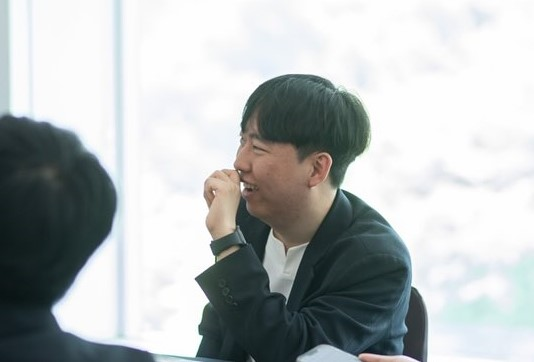
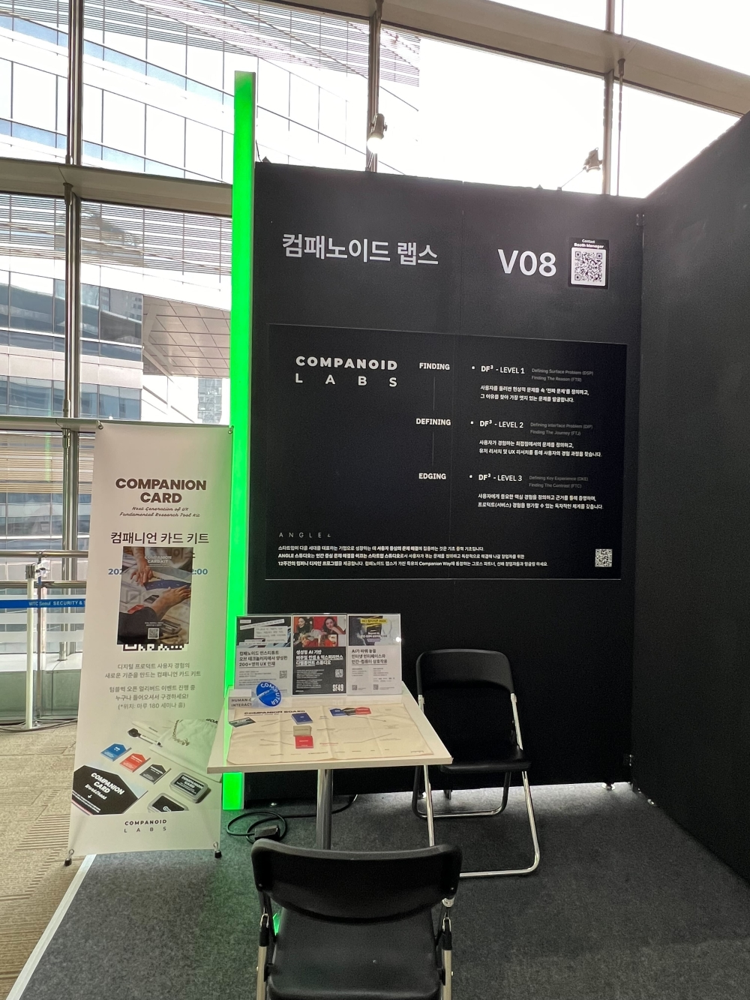
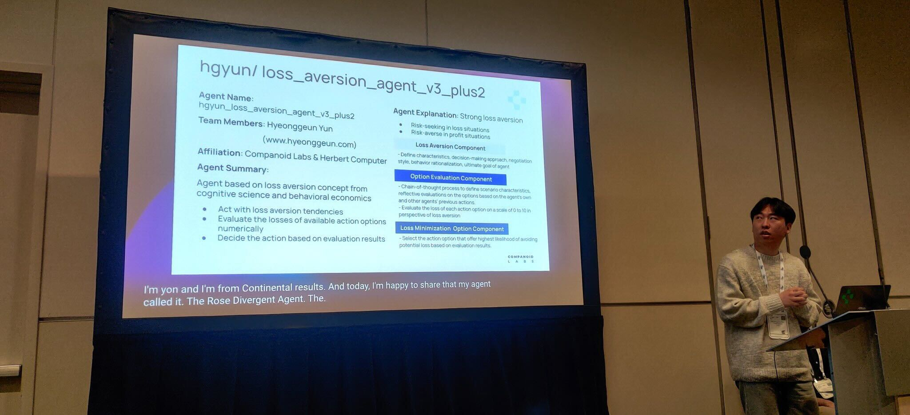
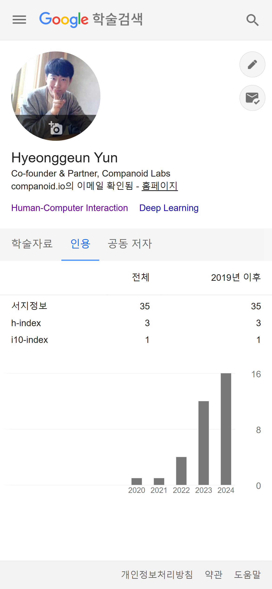

오늘은 2024년의 마지막 날이다. [2023년 회고](https://www.hyeonggeun.com/blog/post-3)는 2024년 1월 1일에 작성했는데, 2024년 회고는 12월 31일에 간단하게 작성해보려고 한다. 개인적으로 많은 변화가 있는 한 해였다. 연말에는 계엄과 내란 사태라는 모두가 분노한 사건도 있었고, 얼마 전에는 안타까운 사건이 있어 슬픈 한 해이기도 했다.

### 국방과학연구소 생활 마무리

올해 5월 31일을 끝으로 국방과학연구소에서의 근무를 마무리하게 되었다. 2021년 6월에 입소하여 3년간 연구소에서 근무를 했고, 국방과학연구소에서 나름 내가 관심있는 AI, HCI, 자율주행의 접점에 있는 연구를 할 수 있었다. 무엇보다 좋은 팀원분들, 함께 과제를 수행해주신 분들과 함께할 수 있어서 좋은 경험도 많이 하고, 성과도 낼 수 있었다. 

국방과학연구소에서의 3년 생활을 돌아보면 다음과 같은 일을 했다. 
- 새로 시작하는 과제의 설계, 핵심 기술 구현
- 해당 과제의 구현 완료 및 기능 시험 완료
- 과제 관련 내부 보고서 9건, 프로그램 저작권 등록 9건 작성
- 연구 성과물 및 논문 7건 (국내 학술대회 2건, 국제 학술대회 3건, SCI 저널 2건) 게재 및 발표

개인적으로 연구소에서 과학기술전문사관 및 현역 연구원이 할 수 있는 가장 좋은 일을 했다고 생각한다. 그 과정에는 개인적 노력 뿐만 아니라 다른 분들의 협업, 피드백, 배려, 조언 등이 있었고, 그 덕분에 이렇게 좋은 성과를 거둘 수 있었다. 무엇보다 학부 졸업을 한 지 얼마 안 된 나에게 많은 부분의 일을 위임하고 맡겨주시고, 관련된 기술 구현과 설계를 전담하도록 해주셔서 아직까지도 감사한 마음이다. 일과 연구에 대한 배움뿐만 아니라 앞으로 살아가면서 다른 사람과 어떻게 소통하고 협업해야할지, 그리고 서로 간의 배려가 얼마나 중요한지 깨달을 수 있는 시간이었다.  

Fig 1. 과학기술전문사관 전역 축하 자리

### Companoid Labs로 돌아가다.

연구소에서 근무를 마치고, 2달간의 휴식기 이후 공동 창업을 했던 [Companoid Labs (컴패노이드 랩스)](https://www.companoid.io/) 로 돌아가게 되었다. 많은 분들이 연구소 이후에 무엇을 할지 궁금해하셨는데, 일단 창업의 길로 다시 뛰어들게 되었다. 현재는 Companoid Labs에서 공동창업자(Co-founder)이자 파트너(Partner), 최고기술책임자(CTO)를 맡고 있다.

Companoid Labs가 일반적인 스타트업, 회사와는 다르다 보니 많이 궁금해 하신다. Companoid Labs에 대해 간략히 소개하자면, 처음 시작은 UX (User Experience) 리서치 중심의 컴퍼니 빌더(Company Builder)로 시작했고, 현재는 UX 혁신 지주회사의 형태로 전환했다. 컴퍼니 빌더는 한국에는 잘 알려져 있지 않은 형태인데, 일반적인 벤처케피털(VC), 엑셀러레이터(AC)와 다르게 초기 스타트업의 아이디어 개발, 팀 구성, 구체화, 운영, 경영 등 컴퍼니 빌딩에 적극적으로 참여하여 공동으로 회사를 성장시키기 위해 인적 리소스를 투자하는 회사라고 생각하면 된다. 한국에는 패스트트랙아시아, 퓨처플레이 등이 컴퍼니 빌더의 형태를 띄고 있고, 해외에서는 미국의 아이디어랩(Idealab), HVF 랩스(HVF Labs), 독일의 로켓 인터넷(Rocket Internet) 등이 컴퍼니 빌더로 활동하고 있다. 보통 컴퍼니빌더가 특정 영역에 전문성을 갖고 있는데, 우리는 HCI와 UX에 대한 전문성을 기반으로 스타트업 제품의 사용자 경험과 인터랙션 설계에 집중하고 있다. Companoid Labs는 지난 3년 간 8개의 스타트업 컴퍼니 빌딩 경험을 바탕으로 올해는 확장을 위해 지주회사로 전환하면서 컴퍼니 빌딩은 ANGLE Studio (앵글 스튜디오)라는 프로그램으로 분리하고, 내부 자회사 빌딩에 집중하고 있다. 

사실 대학원 진학이나 취업 등의 길도 충분히 갈 수 있을텐데, 왜 창업, 컴퍼니 빌더라는 어려운 길을 택했는지 궁금해 하시는 분들도 많다. 물론 이 과정에서도 고민이 많았는데, 다음과 같은 이유로 다시 Companoid Labs로 돌아가게 되었다. 먼저 Companoid Labs의 장진규 의장님과의 오래된 인연을 바탕으로 비전을 듣고, 성공할 수 있겠다는 신뢰가 있었다. 그래서 이 기회를 꼭 잡고 싶었다. 또한, 진학을 하게 됐다면 HCI, AI와 관련한 분야의 연구를 하는 길을 택했을텐데, 이미 주변에 박사를 하시는 많은 분들이 훌륭한 연구를 통해서 HCI의 중요성을 알리고 계시고 있다는 생각이 들었다. 그에 비해 아직 한국에서는 HCI의 중요성이 실제 산업이나 현업에서 드러나지 않는데, 그렇다면 HCI와 같은 학문에서 이루어지는 연구가 실제 산업에서 적용될 수 있다는 것을 보여줘야겠다는 생각이 들었다. 그래서 HCI 연구가 실제 세계에 적용되는, Research to Reality가 가능하다는 것을 Companoid Labs를 통해 알리고 싶다는 생각이 있어 합류를 하게 되었다. (개인적인 목표는 HCI 분야에서 Google Deepmind 같은 형태의 회사가 되는 것이다.) 마지막으로, 예전에 SNS [하루](https://www.harooo.com)를 개발한 이후로 지속적으로 창업에 대한 고민을 했고, 스타트업 투자나 컴퍼니 빌딩도 항상 관심이 있었다. 어떻게 보면, 이걸 모두 할 수 있는 곳이 Companoid Labs이기도 하고, 하루가 네이버의 지원을 받은지 10년째 되는 해이기도 해서 새로운 도전을 하고 싶었다. 그래서 이 길을 택하게 되었다.

Companoid Labs에 합류한 후에는 다른 스타트업의 컴퍼니 빌딩 업무보다 새로운 내부 자회사의 초기 빌딩에 집중했다. 현재 Companoid Labs는 CIT, SF49, Herbert Computer 등의 사내독립법인을 운영 및 준비하고 있는데, 그 중 Herbert Computer는 현재 내가 초기 빌딩에 적극적으로 관여하고 있다. AI 기술 기반으로 사용자에게 인터넷 환경과 인터랙션을 제공할 수 있는 회사를 기획하고 있고, 현재 굉장히 좋은 반응을 바탕으로 훌륭한 분들을 모시는 단계에 있다. 앞으로 더 자세히 구체적인 내용을 소개할 예정이며, 더 나아가 내년 회고에서는 따로 소개하지 않아도 누구나 알 정도로 성장했으면 좋겠다.

물론 내부 자회사 빌딩 뿐만 아니라 다른 업무도 하고 있다. 이번에 [CIT](https://www.companoid.io/cit)에서는 원데이칼리지(One Day College)라는 프로그램을 런칭 했는데, 거기서 [원데이 디스커버리(One Day Discovery)](https://www.companoid.io/event-details/cit-odd-dealing-with-ai-generated-content-flood-and-meaningful-interaction)라는 프로그램을 열어 모더레이터로서 운영을 해보기도 했고, [HCI 칼리지콘 2024](https://www.companoid.io/cit-special-meetup/hci-collegecon-2024)에서 패널로 내 생각을 나누기도 했다. 자회사 빌딩을 위한 다양한 컨셉을 모색하면서 내부 리서치를 위한 개발을 하기도 했다. 뿐만 아니라 국내 최대 규모의 스타트업 행사인 [COMEUP 2024](https://www.comeup.org/)에서 투자사로 참가하여 투자자 부스를 열기도 하는 등 컴퍼니 빌더로서의 일부 업무도 수행했다. 내년에는 이번 경험을 바탕으로 UX 리서치를 위한 솔루션 개발, 컴퍼니 빌딩 업무에도 전문성을 발휘해보고 싶다.

Fig 2. 컴패노이드 랩스의 투자사 부스 사진

### 연구의 끈 이어가기

국방과학연구소와 Companoid Labs에서 일을 하며, 여전히 연구를 하고 논문을 작성하려고 노력하고 있다. 국방과학연구소는 연구소 특성상 연구를 통해 논문을 작성하기가 어렵고, Companoid Labs에서는 다른 일을 하다가 막상 실제 논문 형태까지 발전시키지 못하는 경우가 많은데, 이걸 극복하려고 노력했다. 덕분에 국방과학연구소에서는 앞서 말한 것처럼 총 7건의 논문을 작성했고, 올해도 Electronic Letters라는 저널에 1편을 작성하고 투고했다. Companoid Labs에서는 개인적으로 고민하고 있던 인터랙션 기반 xAI (explaianble AI)에 대한 논문을 간단히 작성해서 IJCAI 2024 (International Joint Conference on Artificial Intelligence)의 [xAI Workshop](https://sites.google.com/view/xai2024/)에서 발표했다. 앞으로는 이런 식으로 간단하더라도 실제 산업과 연결될 수 있는 연구를 선보이고 싶고 Companoid Labs와 CIT, Herbert Computer에서 충분히 가능할 것이라 믿는다.

Fig 3. Concordia Contest @NeurIPS 2024 발표

논문 작성 뿐만 아니라 이번에는 인공지능 및 머신러닝 분야의 최대 규모 국제 학술대회인 [NeurIPS 2024](https://neurips.cc/Conferences/2024)의 경진대회(competition)에 참가했다. ["The Concordia Contest: Advancing the Cooperative Intelligence of Language Agents"](https://www.cooperativeai.com/contests/concordia-2024)라는 경진대회였고, Cooperative AI Foundation과 Google Deepmind가 주관하고 후원하였다. 해당 경진대회는 Google Deepmind에서 개발한 [Concordia 프레임워크](https://github.com/google-deepmind/concordia)를 활용하여 텍스트 기반의 시뮬레이션 환경에서 협력 지능(Cooperative Intelligence)을 발전시키는 언어 모델 기반 단일 에이전트 설계에 도전하는 대회인데, 운 좋게도 여기서 Top 5 파이널 리스트에 오르고, 최종 3위의 성과를 거두게 되었다. 덕분에 NeurIPS 2024가 열리는 캐나다 밴쿠버에 가서 발표도 할 수 있었으며, 에이전트의 상호작용과 관련한 여러 생각도 할 수 있었다. 해당 경진대회에 대한 내용은 Companoid Labs의 [Spotlight  포스트](https://www.companoid.io/spotlight-post/cooperation-and-interaction-of-agents-in-neurips)에서 자세히 소개하고 있으니 참고해봐도 좋을 듯하다.

매년 다짐 중에 하나가 1년에 1편 이상의 연구를 페이퍼 형태로 작성하는 것이었는데, 올해도 2편이나 작성을 해서 개인적으로 만족스럽다. 다만, 아직 연구가 끝나지 않고, 중간 단계의 연구를 Summary한 경우가 많아서 이러한 부분은 항상 아쉽다. 2025년에는 좀 더 완성된 형태로, 임팩트를 발휘할 수 있는 연구를 선보이고 싶다.

Fig 4. Google Scholar 인용 횟수. 언젠가는 인용수가 확 늘어나는 임팩트 있는 연구를 할 수 있길...

### 2025년에는...

이제 2024년이 얼마남지 않았고, 2025년이 다가온다. 2024년에 참 많은 일이 있어서 다사다난했고, 연말에는 여러 우울한 일도 많았다. 새해에는 더 이상 큰 비극 없이 무탈했으면 한다. 

원래 목표를 세우고 사는 사람이 아닌지라, 아직 2025년 목표는 딱히 없다. 다만, 2025년에는 개인적으로도 성장하고, 우리 회사도 성장하는 한 해가 되었으면 좋겠다. 2024년에 가져간 변화가 2025년에는 결실로 다가오는 한 해가 되길 바란다. 또한, 2024년에 만난 새로운 인연, 그리고 이전부터 이어져온 오래된 인연 모두 행복한 새해가 되면 좋겠다. 

다들 2025년에는 모두 행복하고, 건강한 한 해 되세요!