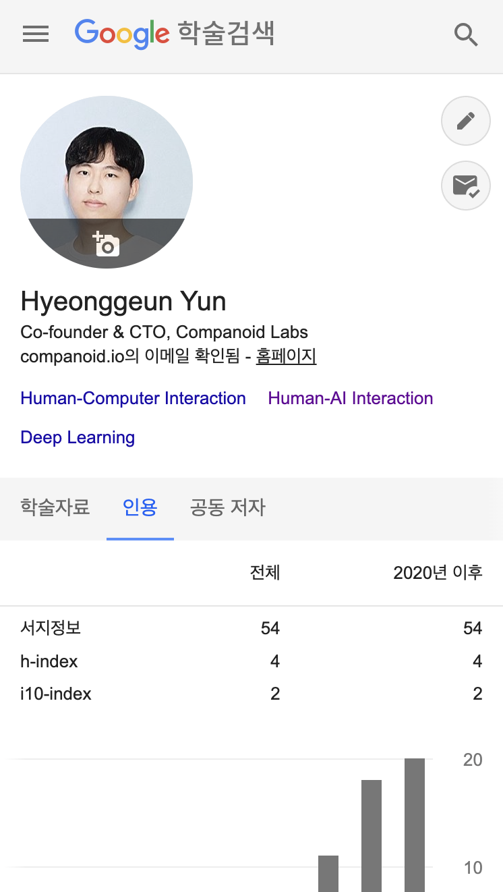
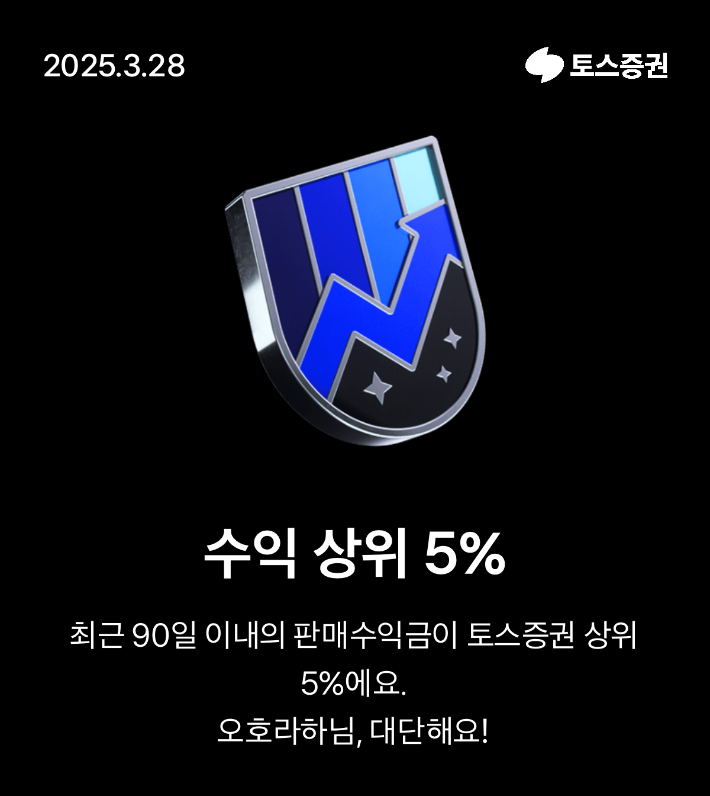
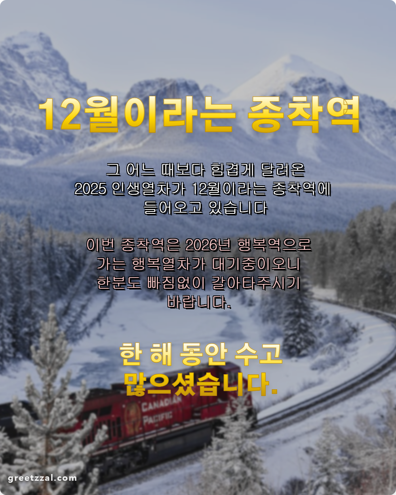

2025년, 한 해가 벌써 지나갔다. 2025년은 체감상 더 빠르게 자나간 느낌이다. 올해도 마찬가지로 한 해를 돌아보며 회고를 해보려고 한다.

### Companoid Labs, 그리고 Herbert Computer, Inc.

[Companoid Labs](https://companoidlabs.com)로 돌아오고 온전히 1년을 보냈다. 본래 컴퍼니 빌더로 시작한 Companoid Labs는 24년 하반기에 지주회사 겸 컴퍼니빌더로 전환한 후, 25년에는 내부를 정비하고 숨을 고르는 과정을 거쳤다. 
별도의 스타트업에 대한 컴퍼니 빌딩보다는 컴퍼니 빌딩 프로세스를 정립하고, 외부의 좋은 파트너분들을 모시고, 자체 프로젝트 및 내부 자회사(CIC)에 집중했다. 덕분에 나름의 체계를 잡았고, CIT, SF49, Herbert Computer 등 여러 CIC에 역량을 끌어올릴 수 있었다. 
CIT는 HCI 칼리지 운영을 필두로, 컨실리언스 크레덴셜 코스(CCC) 런칭, HCI 컴패니언 데이 등의 네트워킹 행사 운영을 순조롭게 진행하고 있고,  SF49도 생성형 AI를 기반으로 한 다양한 프로젝트를 수주하고, 새로운 프로젝트를 기획하고 있다. 
마지막으로 Herbert Computer는 내가 올해 가장 많은 힘을 쏟았는데, 이에 대한 이야기는 아래에서 자세히 하고자 한다.

Herbert Computer의 첫 출발은 24년에 Companoid Labs로 다시 합류하면서 했던 장진규 의장님과의 첫 이야기로부터 시작한다. 
2022년 ChatGPT가 서비스 형태로 출시된 이후 약 2년 동안 LLM을 비롯한 AI 도메인에서 많은 발전이 이루어졌고, 이는 단순히 잠깐 주목을 받는 Hype가 아니라 새로운 패러다임 변화의 가능성을 보여주었다.
특히 사용자의 행동 양식이 기존의 검색 중심에서 답변 중심으로 바뀌었고, 이제는 검색을 중심으로 한 사용자의 주의를 끄는 광고 중심의 비즈니스에서 사용자의 의도를 실제 행동으로 연결해주는 에이전트 중심의 비즈니스로 변할 수 있음을 보여주었다.
우리는 이 지점에서 Herbert Computer를 시작하고자 했다.

실제로 그 후에는 사용자의 텍스트를 기반으로 명령을 하고 이를 수행하는 에이전트에 대한 논의가 등장하였고, 코딩 등 특정 분야에서 이러한 에이전트 역량을 활용하여 높은 효율과 퍼포먼스를 보이는 프로덕트도 등장했다.
이는 사용자가 텍스트를 통해 자신의 컨텍스트와 의도를 잘 전달하면, AI 에이전트가 이를 대신 수행하여 사용자가 일일이 모든 행동을 할 필요 없이 최종 검토와 피드백만 하는 새로운 경험을 전달할 수 있음을 시사했다. 
개인적으로 이러한 경험을 가장 빠르게 전달할 수 있는 분야가 프로그래밍과 관련된 도메인이라고 생각했는데, 왜냐하면 이 분야가 사용자의 분명한 의도와 컨텍스트 → AI 또는 LLM의 이해 및 계획 → LLM이 계획에 맞춰 사용자의 의도에 맞는 행동을 수행 → 사용자가 결과물 평가 및 피드백하는 구조가 명확하다고 생각했기 때문이다. 
따라서 초기에 에이전트 측면에서 접근이 이루어지기 용이했다. 더 나아가 현재는 CLAUDE Code와 같이 바이브 코딩을 위해 등장한 프로덕트가 다양한 프로토콜과 Computer에 대한 이해를 바탕으로 일종의 에이전트로서 동작하고 있고, 이는 사용자가 적절한 컨텍스트를 텍스트로 잘 전달할 수만 있고, 피드백 구조를 설계하면 AI가 여러 행동을 수행할 수 있음을 보여주었다.

이러한 상황에서 우리는 2가지 가능성이자 한계를 발견했다. 먼저, 여전히 AI와의 중요한 접점을 갖는 인터페이스가 CLI 수준에 머물고 있다는 것이다. 텍스트, 발화를 통한 상호작용은 인간의 가장 기본적인 상호작용이기 때문에 접근하기 쉽고, 정보 전달에 측면에서는 장점이 있지만, 사용자의 맥락과 의도를 전달의 어려움, 모호성, 피드백의 어려움 등의 한계가 있다. 
굉장히 말을 잘하거나, 완벽하게 컨텍스트를 전달할 수 있는 사용자라면 CLI를 통한 AI와의 상호작용도 큰 문제가 없겠지만, 대부분의 사용자는 그렇지가 않다. (그렇기 때문에 프롬프트 엔지니어링 등도 등장했다고 생각한다.) 문제는 이러한 컨텍스트의 전달이 AI를 잘 쓰기 위해서는 굉장히 중요한데, 그러한 부분은 현재의 CLI 중심 인터페이스에서는 쉽게 해결하기 어렵다. 
두 번째는 AI와 에이전트 덕분에 생산성이 증가하였으나, 여전히 많은 부분에서 인간의 생산성을 해치고 있다는 것이다. 우리가 웹 환경에서 대부분의 일과 업무를 처리하고 있고, 실제로 많은 서비스, 프로덕트, 심지어 AI 서비스나 여러 Vertical 에이전트도 웹 환경에서 동작하고 있다.
이러한 수많은 웹 기반의 서비스, SaaS, AI 서비스 및 Vertical 에이전트 덕분에 각각의 단일한 서비스나 Vertical Layer에서는 사용자가 원하는 결과물을 얻고, 생산성이 향상되었으나, 이를 연결하고, 통합하여 사용자가 원하는 결과물을 얻기 위해서는 여전히 사용자의 많은 노력이 필요하다.
우리가 하는 많은 작업은 단일 서비스가 아니라 여러 서비스를 조합하고, 이 과정에서 사용자의 의사결정이나 생각이 더해지는 경우가 많은데, 현재의 AI 또는 에이전트는 이를 서포트하기에는 어려움이 존재한다.

이러한 2가지 가능성과 한계를 중심으로 우리는 Herbert Computer를 빌딩하고 있고, 프로덕트를 설계하고 개발중에 있다. 지난 한 해동안 약 40건에 달하는 PoC (Proof of Concept)를 진행했고, 현재는 본격적인 프로덕트 설계 및 개발과 더불어 투자 유치를 진행 중에 있다. 
이 아이디어를 공유했을 때, 가능성을 엿보고 공감해주신 분들, 팀 빌딩과정에서 가능성을 봐주시고, 치열하게 토론해주신 분들, 메가 펀딩을 위해서 투자 유치를 하는 과정에서 비전에 공감해주시고, 검토해주시고, 다양하게 의견을 공유해주신 분들에게 정말 감사하다는 말씀을 이 글을 통해서 드리고 싶다. 
2026년에는 Herbert Computer에 대해서 조금 더 구체적으로 소개해드릴 수 있지 않을까 싶다. 한국이 AI 3강을 향해서 반도체, 파운데이션 모델 등 다양한 부분에서 정부 및 기업 등 각계각층의 노력이 이루어지고 있는데, 우리 Herbert Computer가 AI 인프라이자 어플리케이션 측면에서 새로운 AI 생태계를 만들 수 있을 것이라 믿는다.

### 2025년에도 연구 이어가기

2025년에도 마찬가지로 필요하면 연구를 하고, 논문도 작성하려고 노력했다. 단순히 나의 흥미 위주의 연구 뿐만 아니라 Companoid Labs와 Herbert Computer에서 진행하는 프로젝트에서 연구를 진행하고, 이를 논문 등의 지식재산물로 확장하려고 항상 노력하고 있다. 
물론 이 과정은 어려운 일이고, 항상 힘이 들고 고민스럽지만 HCI 연구에 기반을 둔다는 정체성을 지키기 위해서라도 시간을 들일 필요가 있다고 생각한다. 덕분에 올해 초에는 [CHI 2025](https://chi2025.acm.org/)의 참석하고, [Meta-HCI 워크샵](https://www.meta-hci.org/meta-hci-workshop-chi25.html)에서 Companoid Labs의 Never Enough Project를 기반으로 연구인 [UX Remix](https://arxiv.org/abs/2504.09169)를 발표하기도 했고, 
Herbert Computer의 일부 비전과 컨셉을 푼 [논문](https://arxiv.org/abs/2509.12049)을 작성하기도 했다. 뿐만 아니라 국방과학연구소에서 작성했던 Electronics Letters에 제출한 [논문](https://ietresearch.onlinelibrary.wiley.com/doi/10.1049/ell2.70338)이 엑셉되어 출판되었고, 작년에 NeurIPS 2024의 Concordia Contest에서 거둔 최종 3위의 성과를 기반으로 참여한 [논문](https://openreview.net/forum?id=yG4Fj0voJZ)도 NeurIPS 2025의 Dataset & Benchmarks Track에 발표되었다. 

24년 회고에도 작성했듯이 매년 1편 이상의 연구를 페이퍼 형태로 작성하는 것이 목표인데, 올해도 일단 달성을 한 것 같아서 만족스럽다. [Google Scholar](https://scholar.google.com/citations?user=qh55CiUAAAAJ&hl=ko&authuser=1) 인용 횟수도 작년 대비 20회 늘어서 54회로 50회가 넘었다. 항상 하는 생각이지만 2026년에는 좀 더 완성된 형태로, 임팩트를 발휘할 수 있는 연구를 선보이고 싶다.
특히 Herbert Computer 차원에서 진행할 수 있는 연구가 무궁무진하기 때문에 실제 비즈니스 및 프로덕트 임팩트로 연결될 수 있는 연구를 해야겠다는 마음을 다시 한 번 먹는다.

Fig 1. Google Scholar 인용 횟수. 소소하지만 드디어 50회를 넘었다.

### AI TOP 100 대회 금상 수상

올해를 이야기할 때 뺄 수 없는 이야기 중 하나가 카카오임팩트와 브라이언임팩트에서 주최한 [AI TOP 100 대회](https://aitop100.org)에서 3000명 중 Top 3안에 들어서 금상을 수상한 일이다. 처음에는 그냥 한 번 경험 삼아 출전을 결정했고, 예선 문제도 답에 확신을 갖지 못하는 경우가 존재해서 3000명 중 100명이 선발되는 본선에 진출하기만을 바랐다.
감사하게도 100명에 선발되어 본선에 진출했고, 본선은 예선보다 더 많은 9개의 문제와 훨씬 어려워진 난이도의 문제가 많아서 실제 수상은 기대를 하지 않았다. 그래서 시상식도 열심히 구경만 하고 있었는데, 금상 수상자로 카카오의 정신아 대표님께서 호명을 해주실 때 정말 상상도 하지 못해서 정말 감격했다.
아직도 운이 많이 좋았다는 생각이 들고, 내가 AI를 사용하는 방식이 특별하다고 생각하지는 않지만, 그래도 뭔가 미묘한 차이가 금상으로 이끌었다는 것에서 큰 의미가 있는 것 같다. 26년에는 이러한 이야기를 공유할 수 있는 자리가 있을 것 같고, AI와 함께 문제를 해결하는 방법에 대해서도 고민을 해보는 시간이 될 것 같다.

AI TOP 100 대회 [수상자 명단](https://www.kakaoimpact.org/news/view?atclId=239&recommend=0)과 [문제](https://challenge.aitop100.org/)는 각각의 링크에서 확인할 수 있다.

Fig 2. AI Top 100 대회 수상 후 정신아 대표님과의 기념 사진.

### 기타 개인적인 이야기

그 외 다른 개인적인 이야기를 하자면...

- 최근 트레바리도 하면서 오랜만에 책을 좀 읽고 있다. 다만 장르가 스타트업 투자 및 VC, 야구, 프로그래밍 도서 등 원래 관심 분야로 치우쳐져 있어서, 26년에는 다양한 분야의 독서를 해봐야 겠다. 
- 올해는 4월에는 CHI 참석 겸 일본 요코하마와 도쿄, 6월에는 친구들과 중국 베이징을 다녀왔다. 일본에서는 일본인 아저씨가 일본어 못하는 나에게 호텔 세탁기 및 건조기 사용법을 물어서 알려드렸던 썰(...), 중국에서는 지갑에 다양한 사람들의 명함을 많이 가지고 있어서 오해를 받은 썰(...)이 기억에 남는다.
- 새해를 앞두고 어르신 감성의 새해인사 이미지를 만들 수 있는 서비스인 [무병장수 기원 인사 제조기](https://greetzzal.com/)를 만들었다. 바이브코딩 덕분에 이제 이런 서비스를 더 빠르게 만들 수 있다는 게 참 재밌다. 
- 운동을 좀 해야하는데 올해는 여러 셀프 핑계를 기반으로 운동을 제대로 하지 않았다. 26년에는 예전에 했던 테니스를 다시 시작해볼까 한다.
- 올해는 워낙 장이 좋아서 그런지 주식투자 수익률이 나쁘지 않았다. 전성기 시절에는 토스증권에서 수익 상위 5% 배지도 받았는데, 받고 10일 뒤 쯤에 4월 관세 이슈로 배지를 다시 뺐겼다. 
- 응원하는 두산 베어스가 올해는 9위로 폭망(...)했다. 그래도 감독도 바뀌고, 새로운 선수도 발굴했으니, 내년에는 더 잘하길...
- 졸업한 중고등학교에서 올해 강연(?)할 일이 많았는데, 시간이 지나도 기억해주시고 불러주셔서 항상 감사하다.
- 올해 초에 하스스톤을 오랜만에 좀 했는데, 10년전에는 못했던 전설을 달성했다. 가끔씩 삼국지 14를 하면서 삼국지 인물의 처세술에 대해서도 다시 한 번 배우게 된다.
- 더 이상 무슨 일이 있었는지 잘 기억이 안난다... 생각나면 추가해야겠다.

Fig 3. 토스증권 수익 상위 5% 배지. 물론 10일 뒤에 뺏겼다.

### 2026년에는...

2025년은 2026년 도약을 위한 준비 기간이었다고 생각한다. 2026년에는 위에서 한 다짐과 목표를 모두 이룰 수 있으면 좋겠다. 
또한, 오랫동안 이어진 인연, 2025년에 새롭게 만난 인연, 그냥 이 글을 봐주시는 분들 모두 행복한 새해가 되면 좋겠다.

다들 2026년에는 모두 행복하고, 건강한 한 해 되세요! (사진은 [무병장수 기원 인사 제조기](https://greetzzal.com/)로 만들었습니다. 많은 관심 부탁드립니다.)

Fig 4. 새해 복 많이 받으세요. 무병장수 기원 인사 제조기 서비스 많은 관심 부탁드립니다.
